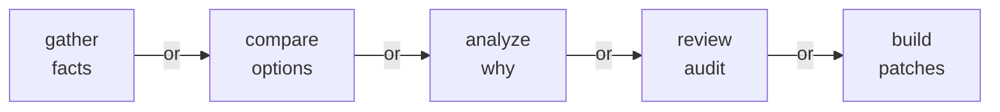
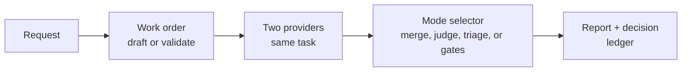

# Bakeoff

<p align="center">
  
</p>

Bakeoff is a second-opinion machine for agent work. You give one clear task to
two providers, they work independently, and Bakeoff collects the evidence in
one repeatable run. Instead of wondering which answer to trust, you get the
provider outputs, the judge or verifier result, and a durable report you can
inspect later.

That is the whole value: two independent attempts, one auditable process, and
no hidden repo mutations. Bakeoff writes run artifacts under `runs/<run-id>/`.
For build work, it captures candidate patches from isolated worktrees and hands
you the selected patch file when there is a clear winner. It does not apply,
merge, commit, push, or open PRs for you.

Generated work orders normally use exactly two providers. The default pair is
Claude + Codex; Gemini and GitHub Copilot can replace one of those initial
peers when you want a different two-agent matchup. After a completed non-build
run, escalation lets you bring in any available provider for a fresh third
answer (`independent`), a sanity check on the report (`witness`), or a focused
challenge to disputed points (`dispute`). Provider secrets stay with the
provider CLIs. Do not put API keys, tokens, or private credentials in work
orders or prompts.

Use Bakeoff when one agent answer would feel too thin: a tricky research
question, a code review where blind spots matter, a comparison with real
tradeoffs, or a fix where tests can choose between two candidate patches. Skip
it for formatter-only work, one-obvious-line edits, or anything where a normal
single-agent pass is cheaper and just as clear.

## Modes

Think of the mode as the shape of the question.

| Mode | Work order | What Bakeoff does | Good prompt |
| --- | --- | --- | --- |
| Gather | `type: "gather"` | Asks both providers to find facts, then merges the useful evidence. | `/bakeoff:run research how auth retry works and cite files` |
| Compare | `type: "compare"` | Asks both providers to weigh named options, then judges the tradeoff. | `/bakeoff:run compare SQLite FTS vs Tantivy for local search` |
| Analyze | `type: "analyze"` | Asks both providers to explain why something happens, then keeps the strongest reasoning. | `/bakeoff:run analyze why reports get truncated` |
| Review | `type: "gather"` + `facet.id: "code-review"` | Asks both providers to review the same change, merges findings, then triages them. | `/bakeoff:run review this diff against main` |
| Plan review | `type: "gather"` + `facet.id: "plan-review"` | Asks both providers to find actionable defects in a plan before implementation. | `/bakeoff:run review docs/implementation-plan.md` |
| Build | `type: "build"` | Asks both providers to implement the same fix in isolated worktrees, runs your gates, and selects a patch only when evidence is strong. | `/bakeoff:run build competing fixes for the failing cache test` |

Mode words are hints, not strict syntax. A request that starts with "why" can
become `analyze`; a request about a diff can become review; a request for
candidate patches becomes build.



## The Pipeline

Every run follows the same simple loop:

1. You ask a question or pass a work-order file.
2. Bakeoff previews the planned work order and waits for approval.
3. Two providers work on the same task independently.
4. Bakeoff merges, judges, triages, or verifies depending on the mode.
5. You inspect the report, decision file, and artifacts before acting.

The mode decides the middle step. Gather merges evidence. Compare and analyze
use a judge. Review adds automatic triage. Build runs verifier commands and
hands off a patch artifact only when there is a canonical winner.



## Quick Start

Prerequisites:

- Claude Code with this plugin installed.
- Go 1.24+ so `/bakeoff:setup` can build the bundled CLI source.
- `git` for review and build workflows.
- An authenticated `claude` CLI for generated judges.
- At least one peer CLI. `codex` is the canonical peer; `gemini` and `copilot`
  are optional peers.

```text
/bakeoff:setup                                           # build bundled Go CLI into plugin data, then check readiness
/bakeoff:run research the auth retry behavior            # natural-language draft → approve → run
/bakeoff:run review this diff against main
/bakeoff:run build competing fixes for this failing test
/bakeoff:run examples/build.work-order.json              # run an existing work order
/bakeoff:history                                         # list recent runs and run ids
```

### A First Run In Your Head

Here is the normal flow with a research task:

1. Run `/bakeoff:run research how auth retry behavior works and cite the files involved`.
2. Bakeoff drafts a work order, shows the providers, judge, goal, budget, and
   command it plans to run.
3. Reply `show` if you want to read the full JSON. Reply `yes`, `approve`, or
   `run it` when the preview looks right.
4. Bakeoff writes the work order, validates it, runs both providers, judges the
   result, and writes `runs/<run-id>/report.md`.
5. Run `/bakeoff:history` if you need the run id, then
   `/bakeoff:inspect <run-id>` to read the report.
6. Act on the report yourself, or approve a separate follow-up run if Bakeoff
   recommends one.

Local development install:

```text
/plugin marketplace add mstefanko-plugins <path>
/plugin install bakeoff@mstefanko-plugins
/reload-plugins
/bakeoff:setup
```

Internal installs track the plugin's git revision instead of an explicit plugin
version. When the plugin source updates, rerun `/bakeoff:setup` to rebuild the
CLI from the updated bundled source. Optional no-Go release binaries are
documented in [docs/release-publishing.md](docs/release-publishing.md).

Codex install: this checkout ships `.codex-plugin/plugin.json`; verify the current Codex plugin flow in Codex docs.

Natural-language requests draft a work order, show a compact review preview,
and wait for explicit approval before writing or running. Single-work-order
previews accept `yes`, `approve`, or `run it`; `show` prints the JSON, `edit`
revises the draft, and `cancel` discards it. Short drafts include the full JSON
inline; longer drafts show the planned work-order file and let you reply
`show` before approving.

For large requests, the plugin may suggest 2-3 separate work orders when the
split is clean. Each part is still a normal Bakeoff run. Eligible non-build
splits can be approved with `parallel` after the preview to launch all parts at
once; `write and run` or `sequential` keeps the one-after-another behavior.
Explicit 2-3 lens review can also run sequentially or in parallel after
preview, and writes a short summary file after the lens runs finish. Sample
work orders live in `examples/` (`gather`, `compare`, `analyze`, `review`,
`plan-review`, `build`).

After a run finishes, `/bakeoff:run` may recommend one next normal work order
when the artifacts make it obvious, such as drafting an implementation plan
from a research report or inspecting a selected build patch. It can also say
that no follow-up Bakeoff run is recommended. Follow-up work still uses the
same preview, validation, and approval flow; there is no automatic chaining.

Generated work orders use exactly two providers. Defaults are `claude/sonnet`
plus `codex/gpt-5.5`, with `claude/opus` as judge. If Codex is missing and
exactly one optional peer is ready, `/bakeoff:run` may draft Claude + that peer
and call out the fallback in the preview. Use full model ids in the work order
to pin exact versions.

When the default judge shares provider-family metadata with one selected
provider, `/bakeoff:run` may show a short judge-family advisory from
`bakeoff doctor`. Treat it as a note, not a rule. It can name ready
non-contestant judge backends such as Gemini or Copilot, but it does not
auto-switch the judge, add `judge_policy`, or make validation fail. In
`doctor --json`, `judge_family_advisory` includes `judge_backend`,
`judge_family`, `provider_backends`, `relation`,
`ready_non_contestant_judges`, `advisory_only`, and
`independence_not_measured_yet`; `relation` is one of `same_as_all`,
`same_as_some`, `different_from_all`, or `unknown`.

### Route Examples

Route advisor lines explain why Bakeoff picked a loop:

| User phrase | Route advisor |
| --- | --- |
| `build ...` with acceptance criteria, edit scope, and a gate | `Why this loop: build-verifier path` |
| `audit this report`, `second opinion on this report`, `fight the findings`, or bare `dispute this report` | `Why this loop: witness audit of current report` |
| `is finding F-007 real` | `Why this loop: focused dispute packet` |
| `second opinion on the question` or `add Gemini to this completed run` | `Why this loop: fresh third answer` |
| Formatter-only, vague one-pass, or otherwise weak-fit requests | `Why this loop: single-agent advised`; reply `draft anyway` to continue |

The build route is a normal `/bakeoff:run` build preview. Build escalation is
not supported.

## Research

Use research when you want evidence, a decision, or a clear explanation before
you change anything.

Think of it as:

**same question -> two independent answers -> mode-specific judge -> report**

Pick the mode by the kind of answer you need:

- `gather`: "Find the facts and cite the source."
- `compare`: "Choose between these options using these criteria."
- `analyze`: "Explain why this happened or what design tradeoff matters."

```text
/bakeoff:run research how auth retry behavior works and cite the files involved
/bakeoff:run compare SQLite FTS vs Tantivy for local product search
/bakeoff:run analyze why provider output caps sometimes produce incomplete reports
```

Example flow:

1. You ask: `/bakeoff:run compare SQLite FTS vs Tantivy for local product search`.
2. Bakeoff previews a `compare` work order with two providers and a judge.
3. You approve it.
4. Both providers answer the same comparison independently.
5. The judge reads both answers, checks whether the ordering changes under A/B
   and B/A position swaps, and returns a winner, consensus, or unresolved tie.
6. You inspect `runs/<run-id>/report.md` and `decision.json`.

After any run, use `/bakeoff:history` to find recent run ids and
`/bakeoff:inspect <run-id>` to open the report. If a research run exits `4`
because the judge failed after both providers succeeded, the usual next step is
`bakeoff rerun <run-id> --judge-only`; build runs do not support judge-only
rerun today.

<details open>
<summary>Research and evidence behind this design</summary>

The evidence says independent attempts are stronger than one single answer. So
Bakeoff asks two selected providers to work separately, then combines or judges
their outputs ([Self-Consistency](https://arxiv.org/abs/2203.11171)).

The evidence also says more agents are not automatically better. Parallel research can help, but coordination and token cost climb quickly ([Anthropic multi-agent research](https://www.anthropic.com/engineering/multi-agent-research-system)). That is why Bakeoff stays small: two providers, one judge, replayable artifacts. When a completed non-build run needs another view, `bakeoff escalate` can add one explicit third provider in a separate run without changing the normal two-provider work-order shape.

For `compare` and `analyze`, Bakeoff also protects against judge order bias. The judge reads A/B and B/A, and a winner or reasoning spine only sticks if it survives the swap ([FairEval](https://arxiv.org/abs/2305.17926)).

More: [docs/research-basis.md](docs/research-basis.md).

</details>

## Review

Use review when you want two independent reviewers to inspect the same branch,
PR, diff, file set, or local change.

Think of it as:

**same scope -> two independent reviews -> one combined finding list -> automatic triage**

Review is implemented as a `gather` run with a `code-review` facet. Both
providers inspect the same target through the same boundaries:

- `focus`: what the review should care about
- `include`: what should be in scope
- `exclude`: what should stay out of scope

The judge does not pick a winning reviewer. It combines the findings, removes
duplicates, and keeps useful candidates. Then Bakeoff runs triage
automatically. Triage checks each finding for actionability, citations, and
staleness before you decide what to fix.

```text
/bakeoff:run review this diff against main
/bakeoff:run review my local changes for correctness and missing tests
/bakeoff:run review this PR with security, performance, and UX lenses
/bakeoff:run review branch feature/auth-cache against main --run-id review-auth-cache
/bakeoff:run review this diff --base main --diff
/bakeoff:run review this diff --no-triage
```

Example flow:

1. You ask: `/bakeoff:run review this diff against main --base main --diff --changed-files`.
2. Bakeoff previews a review work order and shows that triage is on by default.
3. You approve it.
4. Both providers review the same diff context.
5. The judge creates one candidate finding list.
6. Triage checks which findings are actionable, stale, unsupported, or need
   reproduction.
7. You read `runs/<run-id>/report.md` first, then
   `runs/<run-id>/triage/triage.md`.

`--base`, `--diff`, and `--changed-files` capture read-only git context.
`--no-triage` skips the automatic triage step. See
[examples/review.work-order.json](examples/review.work-order.json) for the
facet shape; field-level reference is in
[docs/work-orders.md](docs/work-orders.md).

For plan review before code is written, use a normal `gather` run with
`facet.id: "plan-review"`:

```text
/bakeoff:run review docs/implementation-plan.md
/bakeoff:run review this migration plan for missing verification and rollback
```

Plan-review findings stay in the generic gather shape: `claim`, `evidence`,
`severity`, and `confidence`. The claim should name the plan section, failure
mode, and smallest required plan change. See
[examples/plan-review.work-order.json](examples/plan-review.work-order.json)
for the facet shape.

To run multiple lenses, say so explicitly:

```text
/bakeoff:run review this diff against main with security, performance, and UX as separate lenses
```

Bakeoff previews one normal review run per lens. Reply `write and run` or
`sequential` to run them one after another, or `parallel` when the preview
offers it to launch all 2-3 lens runs at once. Each lens keeps triage on unless
you supplied `--no-triage`. After the lens runs finish, Bakeoff writes
`runs/<base>.multi-lens-summary.md`. Synthesis into one prioritized fix plan is
a separate follow-up approval, not an automatic hidden step.

Parallel child runs use explicit run ids. Because concurrent children race to
update the convenience pointer, `latest` may point to any one child; use the
run ids in the final summary or `bakeoff show <run-id>`.

<details open>
<summary>Research and evidence behind this design</summary>

Persona prompts ("act as a senior reviewer") don't reliably improve review quality and often add noise ([persona prompting limits](https://arxiv.org/abs/2311.10054)). Bounded, context-rich review scopes do ([Rethinking Code Review Workflows](https://arxiv.org/abs/2505.16339)). So Bakeoff drops role-play and uses a `code-review` facet — a shared focus, include list, and exclude list — that both providers and the judge filter against.

LLM reviewers produce real findings mixed with false positives and stale comments at industrial scale ([Ericsson experience report](https://arxiv.org/abs/2507.19115)), and asking one model to self-correct without outside signal generally fails ([self-correction limits](https://arxiv.org/abs/2310.01798)). So Bakeoff runs review additively: each provider can contribute findings, the judge builds one combined candidate list, and automatic triage re-checks that list before you act — a cheap jury rather than self-review ([Replacing Judges with Juries](https://arxiv.org/abs/2404.18796)).

More: [docs/research-basis.md](docs/research-basis.md).

</details>

## Escalation

Use escalation when a completed non-build run needs one more view. Escalation
does not change the source run. It writes a new related run directory and, for
review escalations, can run triage on the escalation provider's new findings.

Escalation is for `gather`, `compare`, `analyze`, and code-review runs. It is
not supported for build runs and never creates a third patch.

```text
/bakeoff:escalate <run-id> --provider gemini --mode witness --dry-run
/bakeoff:escalate <run-id> --provider copilot --mode dispute --dry-run
/bakeoff:inspect <run-id> --bundle
```

Modes:

- `independent`: ask the added provider for a fresh third answer.
- `witness`: ask the added provider to audit the current report and artifacts.
- `dispute`: ask the added provider to focus only on contested points.

Example flow:

1. A compare run ends unresolved, or a review report has a finding you want
   challenged.
2. Run `/bakeoff:escalate <run-id> --provider gemini --mode dispute --dry-run`.
3. Read the dry-run preview: source run, added provider, mode, cost, and scope.
4. If the preview fits, approve it. Bakeoff runs the escalation and writes a
   related child run.
5. Inspect the source plus children with `/bakeoff:inspect <run-id> --bundle`.

`witness` and `dispute` are advisory. They cannot pick a new winner and cannot
replace source-run triage. If review triage failed or is missing, retry triage
first with `/bakeoff:inspect <run-id> --triage-force` or
`bakeoff triage <run-id> --force`; use escalation only when you still need
another provider's opinion.

## Build

Think of `build` as:

**same task -> two isolated patches -> gates and metrics -> handoff patch**

Build mode asks two providers to implement the same request in separate worktrees. Bakeoff captures each patch, runs the verifier commands you declared, and selects a winner only when the evidence is conclusive.

Bakeoff stops at the handoff. It does not apply, merge, commit, push, open a PR, or synthesize a third patch.

Use `build` when verification can actually help: performance work, robustness fixes, dependency migrations, refactors, tricky bugs, or partial-test UX changes. Skip it for mechanical edits, formatter-only work, or one-clear-path fixes.

```text
/bakeoff:run build competing fixes for the failing cache invalidation test
/bakeoff:run build two approaches for reducing ledger scan time, verify with go test ./...
/bakeoff:run build a safer parser for work-order JSONC with tests as the gate
```

Example flow:

1. You ask for a build and name the acceptance criteria, edit scope, and gate
   command, such as `go test ./internal/cache -run TestInvalidation -count=1`.
2. Bakeoff previews a build work order with two `codebase` providers and the
   verifier command.
3. You approve it.
4. Each provider implements in an isolated worktree.
5. Bakeoff captures each patch, runs the declared gates and metrics, then
   selects a winner only when the evidence is strong enough.
6. If there is a canonical winner, you inspect
   `runs/<run-id>/providers/<winner>/build/diff.patch` and decide what to do
   with it yourself.

Minimum build work order: `type: "build"`, two `codebase` providers, and at least one `kind: "gate"` verifier. If verifier scripts or fixtures must not be edited, list them in `build.protected_paths`; patches that touch protected paths become ineligible.

Metric verifiers require `metric.min_delta_percent`. `bakeoff validate` also
warns when `metric.noise_floor_percent` is omitted, when a declared noise floor
still uses one run, when a repo-relative metric command is not protected, and
when `metric.min_runs > 1` means the final JSON must include `n`.

When the id, goal, acceptance criteria, edit scope, and gate command are already
known, `bakeoff draft-build` prints validated build JSON to stdout without
writing a file:

```sh
bakeoff draft-build \
  --id cache-invalidation-fix \
  --goal "Fix stale cache invalidation" \
  --acceptance "Stale cache entries are invalidated after writes." \
  --scope "internal/cache" \
  --gate "tests=go test ./internal/cache -run TestInvalidation -count=1"
```

See [examples/build.work-order.json](examples/build.work-order.json) for the full shape and [docs/work-orders.md](docs/work-orders.md) for field reference.

If there is a canonical winner, the handoff patch is `runs/<run-id>/providers/<winner>/build/diff.patch`.

<details open>
<summary>Research and evidence behind this design</summary>

The evidence says multiple code candidates can improve quality, but only when the selector is strong. So Build mode treats selection as the hard part, not generation ([AlphaCode](https://arxiv.org/abs/2203.07814), [Large Language Monkeys](https://arxiv.org/abs/2407.21787)).

The evidence also says executed checks beat text-only judgment when they are available. So Bakeoff requires a gate verifier, runs gates before judging, and only uses metrics or an LLM judge after the verifier evidence is in ([CodeT](https://arxiv.org/abs/2207.10397), [MBR-EXEC](https://arxiv.org/abs/2204.11454), [DOCE](https://arxiv.org/abs/2408.13745)).

Green tests are still not proof, and LLM judges can be biased by order or verbosity. So Bakeoff records caveats, uses swapped judging only when gates and metrics cannot decide, and exits `3` instead of guessing when the judge disagrees ([SWE-bench correctness audit](https://arxiv.org/abs/2503.15223), [FairEval](https://arxiv.org/abs/2305.17926)).

More: [docs/competitive-builds-evidence-2026-05-18.md](docs/competitive-builds-evidence-2026-05-18.md).

</details>

## Artifacts

Every run lands in `runs/<run-id>/`:

```text
runs/<run-id>/
├── work-order.json            # exact work order used
├── report.md                  # human-readable report
├── decision.json              # machine-readable decision
├── manifest.json              # ledger integrity and telemetry
├── providers/<provider-id>/
│   ├── stdout, stderr, prompts
│   └── build/                 # build runs only
│       ├── diff.patch         # ← handoff patch (winner only)
│       ├── diffstat.txt
│       ├── changed-files.txt
│       └── verify/result.json
├── judge/                     # judge prompts and outputs
└── triage/                    # review runs only
    ├── triage.md
    ├── status.json
    ├── citation_checks.json
    └── source_finding_filter.json
```

Manifest telemetry fields are documented in [docs/cli-reference.md#manifest-telemetry](docs/cli-reference.md#manifest-telemetry).
Use `bakeoff runs verify <run-id> --json` to check required artifacts,
manifest fingerprints, and triage state.

Common inspection flow:

```text
/bakeoff:history                         # find the run id
/bakeoff:inspect <run-id>                # read report.md
/bakeoff:inspect <run-id> --verify       # check ledger and manifest state
/bakeoff:inspect <run-id> --bundle       # read source run plus escalations
```

For review runs, inspect `triage/triage.md` before treating findings as ready
to fix. For build runs, inspect `diagnostics.json` when present and use the
selected patch path only when `decision.json.canonical_winner` is non-null.

| Exit | Meaning |
| --- | --- |
| `0` | Success. |
| `1` | Runtime, provider, verifier, or build failure. |
| `2` | Usage, config, validation, or missing-input error. |
| `3` | Completed run with unresolved judge disagreement. |
| `4` | Decision incomplete: judge failed or did not converge; provider artifacts are durable. |
| `130` | Interrupted. |

Exit `3` is a completed handoff with no canonical winner — not a launcher failure. For research runs, exit `4` means retrying the judge with `bakeoff rerun <run-id> --judge-only` is usually the right next step when both providers succeeded. Build runs do not support judge-only rerun today; inspect diagnostics or rerun the full build when warranted. See [docs/artifacts-and-ledger.md](docs/artifacts-and-ledger.md).

## Commands

Slash commands:

- `/bakeoff:setup` — build or update the bundled Bakeoff Go CLI in persistent plugin data, then run readiness probes.
- `/bakeoff:run <path or request> [--run-id ID] [--out runs] [--base REF] [--diff] [--changed-files] [--quiet] [--keep-worktrees] [--no-triage] [--no-repo-layout]` — validate and run, or draft from natural language.
- `/bakeoff:escalate <run-id> --provider gemini --mode independent|witness|dispute --dry-run` — preview or run one post-run non-build provider escalation.
- `/bakeoff:history [limit] [--out runs] [--facet ID] [--triage-state STATE] [--type TYPE]` — list recent runs with run ids and short goal summaries.
- `/bakeoff:inspect [latest or run-id] [--list] [--verify] [--bundle] [--triage-dry-run] [--triage-force]` — open existing reports, decisions, triage, handoff, verification, or source-plus-escalation bundles.
- `/bakeoff:doctor [--skip-auth-probe] [--build] [--quiet]` — readiness check. Reports the canonical pair, optional providers, provider-family metadata, any draft-time fallback, and a judge family advisory for the default generated judge when applicable. `--build` runs live edit probes.
- `/bakeoff:uninstall` — remove plugin state, then guide manual plugin uninstall.

Core CLI: `bakeoff draft-build`, `bakeoff validate`, `bakeoff research`, `bakeoff build`, `bakeoff rerun`, `bakeoff escalate`, `bakeoff ls`, `bakeoff show`, `bakeoff bundle`, `bakeoff runs verify`, `bakeoff triage`, `bakeoff doctor`. Full reference in [docs/cli-reference.md](docs/cli-reference.md).

## Configuration

The work order is the main configuration file for a run. It carries the mode, providers, scope, budgets, verifiers, protected paths, and output caps.

Most users do not write work orders by hand. When you run `/bakeoff:run ...` with a natural-language request, Claude drafts the work order, shows a compact review preview, and waits for approval before running it. Build fast-path drafts use `bakeoff draft-build` to generate validated stdout JSON before the preview. You can reply `show` to print the full JSON before approving, or pass an existing work-order file when you want exact control.

See [docs/work-orders.md](docs/work-orders.md) for the full work-order reference.

Setup is handled by `/bakeoff:setup`, which builds the bundled `bakeoff` Go CLI into persistent Claude plugin data. If the plugin cannot find a usable CLI, install Go 1.24+ and run `/bakeoff:setup`.

Advanced launcher settings, release mirrors, and binary override variables are documented in [docs/cli-reference.md](docs/cli-reference.md).

## Why Bakeoff Stays Thin

The plugin drafts work orders, invokes the CLI, and summarizes artifacts. The Go CLI owns validation, provider execution, scope handling, judging, verifier execution, patch capture, reports, triage, exit codes, and ledger integrity. Full orchestration adds scheduling, role coordination, shared state, retries, and synthesis semantics — Bakeoff's strongest property is that every run is small, pairwise, replayable, and auditable, and that property erodes fast as you add machinery.

## Troubleshooting

| Problem | Cause | Try |
| --- | --- | --- |
| Bakeoff CLI not found | No setup-built binary and no `BAKEOFF_GO_BINARY`. | Install Go 1.24+ and run `/bakeoff:setup`, or set `BAKEOFF_GO_BINARY` to a trusted binary. |
| Setup reports a missing release asset | You used the optional `--from-release` path for a tag with no GitHub Release archive or `checksums.txt`. | Use the default `/bakeoff:setup` source build, or publish the matching release assets. |
| Provider auth failed | Provider CLI found but session not ready. | Log in with the provider CLI directly, then rerun `/bakeoff:doctor`. |
| Build readiness failed | Live edit probes couldn't complete in temp workspaces. | Inspect doctor output for sandbox, network, filesystem, or auth failures. |
| No selected build patch | No canonical winner, or evidence not strong enough. | Inspect `decision.json`, `diagnostics.json`, and provider build artifacts. Exit `3` means unresolved, not corrupt. |
| Triage stale or missing | Triage hasn't run, or inputs changed. | `bakeoff triage <run-id> --force`. |

## Uninstall

```text
/bakeoff:uninstall
/plugin uninstall bakeoff@mstefanko-plugins
```

Removes plugin state and cache. Does not remove provider CLIs, provider auth files, git branches, user commits, non-Bakeoff `runs/` content, or dev binaries.

## Development

```bash
go test ./...
go test -race ./...
python3 scripts/parity-go.py
```

Contributor docs: [docs/cli-reference.md](docs/cli-reference.md), [docs/work-orders.md](docs/work-orders.md), [docs/artifacts-and-ledger.md](docs/artifacts-and-ledger.md).
