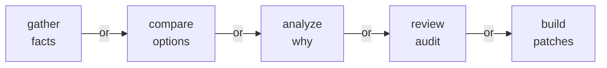
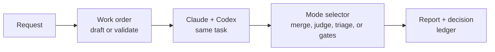

# Bakeoff

<p align="center">
  
</p>

Bakeoff turns agent comparison into a repeatable workflow. Give Claude and Codex the same research, review, or build task; Bakeoff runs them in parallel, collects their work, judges the outputs, and returns a report with replayable artifacts.

The tool is deliberately small and transparent. It launches providers, records artifacts, runs verification or judging, and writes a ledger, while leaving your checkout untouched. No surprise patches, no automatic PRs, no hidden state. Just parallel agent work with enough evidence to audit, reproduce, and trust the result.

## Modes

| Mode | Work order | Use when | Example |
| --- | --- | --- | --- |
| Gather | `type: "gather"` | Inventories, source-backed findings, coverage questions. | `/bakeoff:run research how auth retry works` |
| Compare | `type: "compare"` | Choosing between options, vendors, designs. | `/bakeoff:run compare SQLite FTS vs Tantivy` |
| Analyze | `type: "analyze"` | Root cause, architecture, synthesis. | `/bakeoff:run why reports get truncated` |
| Review | `type: "gather"` + `facet.id: "code-review"` | Auditing a branch, PR, diff, or local change. | `/bakeoff:run review this diff against main` |
| Build | `type: "build"` | Competing implementations with verifiers as the selector. | `/bakeoff:run build competing fixes for the failing test` |

Mode words are steering hints, not required syntax: `/bakeoff:run` infers the work-order type from the request, so a "why" question can draft an `analyze` work order without saying `analyze`.



## The Pipeline

Every Bakeoff run has the same shape. The mode determines what the judge does and whether verifiers or triage run.



## Quick Start

Prerequisites: Claude Code with this plugin installed; Go 1.24+ so `/bakeoff:setup` can build the bundled CLI source; `git` for review and build; authenticated `claude` and `codex` CLIs for live runs. Provider auth lives with the provider CLIs — don't put secrets in work orders.

```text
/bakeoff:setup                                           # build bundled Go CLI into plugin data
/bakeoff:quickstart                                      # check CLI, tools, and provider auth
/bakeoff:run research the auth retry behavior            # natural-language draft → approve → run
/bakeoff:run review this diff against main
/bakeoff:run build competing fixes for this failing test
/bakeoff:run examples/build.work-order.json              # run an existing work order
```

Local development install:

```text
/plugin marketplace add mstefanko-plugins <path>
/plugin install bakeoff@mstefanko-plugins
/reload-plugins
/bakeoff:setup
/bakeoff:quickstart
```

Internal installs track the plugin's git revision instead of an explicit plugin
version. When the plugin source updates, rerun `/bakeoff:setup` to rebuild the
CLI from the updated bundled source. Optional no-Go release binaries are
documented in [docs/release-publishing.md](docs/release-publishing.md).

Codex install: this checkout ships `.codex-plugin/plugin.json`; verify the current Codex plugin flow in Codex docs.

Natural-language requests draft a work order, show a compact review preview, and wait for explicit approval before writing or running. Short drafts include the full JSON inline; longer drafts show the planned work-order file and let you reply `show` to print the JSON before approving. For large requests, the plugin may suggest 2-3 separate work orders when the split is clean; each part is still a normal Bakeoff run. Sample work orders live in `examples/` (`gather`, `compare`, `analyze`, `review`, `build`).

Generated work orders use Claude model aliases (`sonnet`, `opus`) so defaults stay current; use full model ids in the work order to pin exact versions.

## Research

Think of research as:

**same task -> two independent answers -> mode-specific judge -> report**

`gather`, `compare`, and `analyze` use the same basic pipeline. Claude and Codex each work from the same request, then Bakeoff judges the results differently depending on the mode:

- `gather`: combines overlapping claims into one cited list
- `compare`: judges named options and returns a winner, consensus, or tie
- `analyze`: judges explanation spines and keeps the strongest evidence-backed reasoning

Simple rule: use `gather` when you want breadth and citations, like "find every place this happens." Use `compare` when you can name the options and criteria. Use `analyze` when you need root cause, architecture tradeoffs, or a clear answer to "why did this happen?"

```text
/bakeoff:run research how auth retry behavior works and cite the files involved
/bakeoff:run compare SQLite FTS vs Tantivy for local product search
/bakeoff:run analyze why provider output caps sometimes produce incomplete reports
```

After a run: `bakeoff show <run-id>`.

<details open>
<summary>Research and evidence behind this design</summary>

The evidence says independent attempts are stronger than one single answer. So Bakeoff asks Claude and Codex to work separately, then combines or judges their outputs ([Self-Consistency](https://arxiv.org/abs/2203.11171)).

The evidence also says more agents are not automatically better. Parallel research can help, but coordination and token cost climb quickly ([Anthropic multi-agent research](https://www.anthropic.com/engineering/multi-agent-research-system)). That is why Bakeoff stays small: two providers, one judge, replayable artifacts.

For `compare` and `analyze`, Bakeoff also protects against judge order bias. The judge reads A/B and B/A, and a winner or reasoning spine only sticks if it survives the swap ([FairEval](https://arxiv.org/abs/2305.17926)).

More: [docs/research-basis.md](docs/research-basis.md).

</details>

## Review

Think of `review` as:

**same scope -> two independent reviews -> one combined finding list -> automatic triage**

Review is implemented as a `gather` run with a `code-review` facet. Both providers inspect the same branch, diff, or local changes through the same review boundaries:

- `focus`: what the review should care about
- `include`: what should be in scope
- `exclude`: what should stay out of scope

The judge does not pick a winning reviewer. It combines the findings from both providers, removes duplicates, and keeps the useful candidates.

Then Bakeoff runs triage automatically. Triage checks each finding for actionability, citations, and staleness before you decide what to fix.

```text
/bakeoff:run review this diff against main
/bakeoff:run review my local changes for correctness and missing tests
/bakeoff:run review branch feature/auth-cache against main --run-id review-auth-cache
/bakeoff:run review this diff --base main --diff
/bakeoff:run review this diff --no-triage
```

`--base` and `--diff` capture read-only git context. `--no-triage` skips the automatic triage step for review runs. See [examples/review.work-order.json](examples/review.work-order.json) for the facet shape; field-level reference is in [docs/work-orders.md](docs/work-orders.md).

After a run, open `runs/<run-id>/report.md` first. Then open `runs/<run-id>/triage/triage.md`, unless you used `--no-triage`.

<details open>
<summary>Research and evidence behind this design</summary>

Persona prompts ("act as a senior reviewer") don't reliably improve review quality and often add noise ([persona prompting limits](https://arxiv.org/abs/2311.10054)). Bounded, context-rich review scopes do ([Rethinking Code Review Workflows](https://arxiv.org/abs/2505.16339)). So Bakeoff drops role-play and uses a `code-review` facet — a shared focus, include list, and exclude list — that both providers and the judge filter against.

LLM reviewers produce real findings mixed with false positives and stale comments at industrial scale ([Ericsson experience report](https://arxiv.org/abs/2507.19115)), and asking one model to self-correct without outside signal generally fails ([self-correction limits](https://arxiv.org/abs/2310.01798)). So Bakeoff runs review additively: each provider can contribute findings, the judge builds one combined candidate list, and automatic triage re-checks that list before you act — a cheap jury rather than self-review ([Replacing Judges with Juries](https://arxiv.org/abs/2404.18796)).

More: [docs/research-basis.md](docs/research-basis.md).

</details>

## Build

Think of `build` as:

**same task -> two isolated patches -> gates and metrics -> handoff patch**

Build mode asks two providers to implement the same request in separate worktrees. Bakeoff captures each patch, runs the verifier commands you declared, and selects a winner only when the evidence is conclusive.

Bakeoff stops at the handoff. It does not apply, merge, commit, push, open a PR, or synthesize a third patch.

Use `build` when verification can actually help: performance work, robustness fixes, dependency migrations, refactors, tricky bugs, or partial-test UX changes. Skip it for mechanical edits, formatter-only work, or one-clear-path fixes.

```text
/bakeoff:run build competing fixes for the failing cache invalidation test
/bakeoff:run build two approaches for reducing ledger scan time, verify with go test ./...
/bakeoff:run build a safer parser for work-order JSONC with tests as the gate
```

Minimum build work order: `type: "build"`, two `codebase` providers, and at least one `kind: "gate"` verifier. If verifier scripts or fixtures must not be edited, list them in `build.protected_paths`; patches that touch protected paths become ineligible.

See [examples/build.work-order.json](examples/build.work-order.json) for the full shape and [docs/work-orders.md](docs/work-orders.md) for field reference.

If there is a canonical winner, the handoff patch is `runs/<run-id>/providers/<winner>/build/diff.patch`.

<details open>
<summary>Research and evidence behind this design</summary>

The evidence says multiple code candidates can improve quality, but only when the selector is strong. So Build mode treats selection as the hard part, not generation ([AlphaCode](https://arxiv.org/abs/2203.07814), [Large Language Monkeys](https://arxiv.org/abs/2407.21787)).

The evidence also says executed checks beat text-only judgment when they are available. So Bakeoff requires a gate verifier, runs gates before judging, and only uses metrics or an LLM judge after the verifier evidence is in ([CodeT](https://arxiv.org/abs/2207.10397), [MBR-EXEC](https://arxiv.org/abs/2204.11454), [DOCE](https://arxiv.org/abs/2408.13745)).

Green tests are still not proof, and LLM judges can be biased by order or verbosity. So Bakeoff records caveats, uses swapped judging only when gates and metrics cannot decide, and exits `3` instead of guessing when the judge disagrees ([SWE-bench correctness audit](https://arxiv.org/abs/2503.15223), [FairEval](https://arxiv.org/abs/2305.17926)).

More: [docs/competitive-builds-evidence-2026-05-18.md](docs/competitive-builds-evidence-2026-05-18.md).

</details>

## Artifacts

Every run lands in `runs/<run-id>/`:

```text
runs/<run-id>/
├── work-order.json            # exact work order used
├── report.md                  # human-readable report
├── decision.json              # machine-readable decision
├── manifest.json              # ledger integrity
├── providers/<provider-id>/
│   ├── stdout, stderr, prompts
│   └── build/                 # build runs only
│       ├── diff.patch         # ← handoff patch (winner only)
│       ├── diffstat.txt
│       ├── changed-files.txt
│       └── verify/result.json
├── judge/                     # judge prompts and outputs
└── triage/                    # review runs only
    ├── triage.md
    ├── status.json
    ├── citation_checks.json
    └── source_finding_filter.json
```

| Exit | Meaning |
| --- | --- |
| `0` | Success. |
| `1` | Runtime, provider, verifier, or build failure. |
| `2` | Usage, config, validation, or missing-input error. |
| `3` | Completed run with unresolved judge disagreement. |
| `130` | Interrupted. |

Exit `3` is a completed handoff with no canonical winner — not a launcher failure. See [docs/artifacts-and-ledger.md](docs/artifacts-and-ledger.md).

## Commands

Slash commands:

- `/bakeoff:setup` — build or update the bundled Bakeoff Go CLI in persistent plugin data.
- `/bakeoff:quickstart` — check CLI, local readiness, and provider auth/session state.
- `/bakeoff:run <path or request> [--run-id ID] [--out runs] [--quiet] [--keep-worktrees] [--no-triage]` — validate and run, or draft from natural language.
- `/bakeoff:inspect [latest or run-id]` — open existing reports, decisions, triage, handoff.
- `/bakeoff:doctor [--skip-auth-probe] [--build] [--quiet]` — readiness check. `--build` runs live edit probes.
- `/bakeoff:uninstall` — remove plugin state, then guide manual plugin uninstall.

Core CLI: `bakeoff validate`, `bakeoff research`, `bakeoff build`, `bakeoff show`, `bakeoff triage`, `bakeoff doctor`. Full reference in [docs/cli-reference.md](docs/cli-reference.md).

## Configuration

The work order is the main configuration file for a run. It carries the mode, providers, scope, budgets, verifiers, protected paths, and output caps.

Most users do not write work orders by hand. When you run `/bakeoff:run ...` with a natural-language request, Claude drafts the work order, shows a compact review preview, and waits for approval before running it. You can reply `show` to print the full JSON before approving, or pass an existing work-order file when you want exact control.

See [docs/work-orders.md](docs/work-orders.md) for the full work-order reference.

Setup is handled by `/bakeoff:setup`, which builds the bundled `bakeoff` Go CLI into persistent Claude plugin data. If the plugin cannot find a usable CLI, install Go 1.24+ and run `/bakeoff:setup`.

Advanced launcher settings, release mirrors, and binary override variables are documented in [docs/cli-reference.md](docs/cli-reference.md).

## Why Bakeoff Stays Thin

The plugin drafts work orders, invokes the CLI, and summarizes artifacts. The Go CLI owns validation, provider execution, scope handling, judging, verifier execution, patch capture, reports, triage, exit codes, and ledger integrity. Full orchestration adds scheduling, role coordination, shared state, retries, and synthesis semantics — Bakeoff's strongest property is that every run is small, pairwise, replayable, and auditable, and that property erodes fast as you add machinery.

## Troubleshooting

| Problem | Cause | Try |
| --- | --- | --- |
| Quickstart can't find a CLI | No setup-built binary and no `BAKEOFF_GO_BINARY`. | Install Go 1.24+ and run `/bakeoff:setup`, or set `BAKEOFF_GO_BINARY` to a trusted binary. |
| Setup reports a missing release asset | You used the optional `--from-release` path for a tag with no GitHub Release archive or `checksums.txt`. | Use the default `/bakeoff:setup` source build, or publish the matching release assets. |
| Provider auth failed | Provider CLI found but session not ready. | Log in with the provider CLI directly, rerun `/bakeoff:quickstart` or `/bakeoff:doctor`. |
| Build readiness failed | Live edit probes couldn't complete in temp workspaces. | Inspect doctor output for sandbox, network, filesystem, or auth failures. |
| No selected build patch | No canonical winner, or evidence not strong enough. | Inspect `decision.json`, `diagnostics.json`, and provider build artifacts. Exit `3` means unresolved, not corrupt. |
| Triage stale or missing | Triage hasn't run, or inputs changed. | `bakeoff triage <run-id> --force`. |

## Uninstall

```text
/bakeoff:uninstall
/plugin uninstall bakeoff@mstefanko-plugins
```

Removes plugin state and cache. Does not remove provider CLIs, provider auth files, git branches, user commits, non-Bakeoff `runs/` content, or dev binaries.

## Development

```bash
go test ./...
go test -race ./...
python3 scripts/parity-go.py
```

Contributor docs: [docs/cli-reference.md](docs/cli-reference.md), [docs/work-orders.md](docs/work-orders.md), [docs/artifacts-and-ledger.md](docs/artifacts-and-ledger.md).
