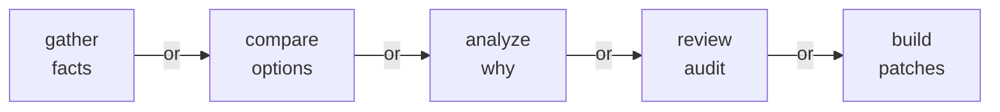
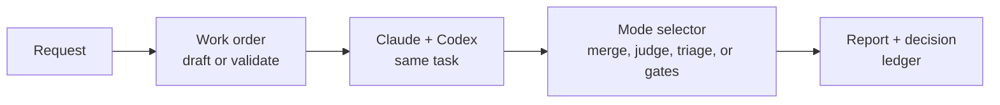
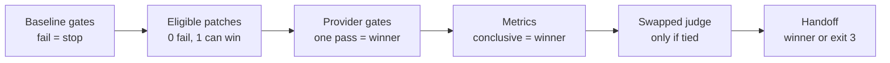

# Bakeoff

Bakeoff turns agent comparison into a repeatable workflow. Give Claude and Codex the same research, review, or build task; Bakeoff runs them in parallel, collects their work, judges the outputs, and returns a report with replayable artifacts.

The tool is deliberately small and transparent. It launches providers, records artifacts, runs verification or judging, and writes a ledger, while leaving your checkout untouched. No surprise patches, no automatic PRs, no hidden state. Just parallel agent work with enough evidence to audit, reproduce, and trust the result.

## Modes

| Mode | Work order | Use when | Example |
| --- | --- | --- | --- |
| Gather | `type: "gather"` | Inventories, source-backed findings, coverage questions. | `/bakeoff:run research how auth retry works` |
| Compare | `type: "compare"` | Choosing between options, vendors, designs. | `/bakeoff:run compare SQLite FTS vs Tantivy` |
| Analyze | `type: "analyze"` | Root cause, architecture, synthesis. | `/bakeoff:run analyze why reports get truncated` |
| Review | `type: "gather"` + `facet.id: "code-review"` | Auditing a branch, PR, diff, or local change. | `/bakeoff:run review this diff against main` |
| Build | `type: "build"` | Competing implementations with verifiers as the selector. | `/bakeoff:run build competing fixes for the failing test` |



## The Pipeline

Every Bakeoff run has the same shape. The mode determines what the judge does and whether verifiers or triage run.



## Quick Start

Prerequisites: Claude Code with this plugin installed; `git` for review and build; authenticated `claude` and `codex` CLIs for live runs; Go 1.24+ unless you have `dist/bakeoff` or set `BAKEOFF_GO_BINARY`. Provider auth lives with the provider CLIs — don't put secrets in work orders.

```text
/bakeoff:quickstart                                      # locate or build the CLI, run readiness
/bakeoff:run research the auth retry behavior            # natural-language draft → approve → run
/bakeoff:run review this diff against main
/bakeoff:run build competing fixes for this failing test
/bakeoff:run examples/build.work-order.json              # run an existing work order
```

Local development install:

```text
/plugin marketplace add mstefanko-plugins <path>
/plugin install bakeoff@mstefanko-plugins
/reload-plugins
/bakeoff:quickstart
```

Codex install: this checkout ships `.codex-plugin/plugin.json`; verify the current Codex plugin flow in Codex docs.

Natural-language requests draft a work order, show the full JSON, and wait for explicit approval before writing or running. For large requests, the plugin may suggest 2-3 separate work orders when the split is clean; each part is still a normal Bakeoff run. Sample work orders live in `examples/` (`gather`, `compare`, `analyze`, `review`, `build`).

## Research

`gather`, `compare`, and `analyze` use the same pipeline; only the judge differs. Gather dedupes claims and preserves citations. Compare and analyze use swapped A/B and B/A judging to pick a winner, consensus, or tie.

Simple rule: use `gather` when you want breadth and citations, like "find every place this happens." Use `compare` when you can name the options and criteria. Use `analyze` when you need an evidence-backed reasoning spine, such as root cause, architecture tradeoffs, or "why did this happen?"

```text
/bakeoff:run research how auth retry behavior works and cite the files involved
/bakeoff:run compare SQLite FTS vs Tantivy for local product search
/bakeoff:run analyze why provider output caps sometimes produce incomplete reports
```

After a run: `bakeoff show <run-id>`.

<details open>
<summary>Research and evidence behind this design</summary>

Sampling multiple independent reasoning paths and aggregating them beats single-shot generation on robustness ([Self-Consistency](https://arxiv.org/abs/2203.11171)). So Bakeoff asks Claude and Codex for independent artifacts instead of chaining one off the other. Parallel breadth helps on open-ended research, but coordination and token cost grow superlinearly with agent count ([Anthropic multi-agent research](https://www.anthropic.com/engineering/multi-agent-research-system)). That cost curve is why Bakeoff stays strictly pairwise — two providers, one judge — and does not spawn a swarm.

LLM judges show measurable order bias: the candidate placed first wins more often than chance ([FairEval](https://arxiv.org/abs/2305.17926)). So `compare` and `analyze` both judge A/B and B/A, and a winner or spine only sticks if it survives the swap.

More: [docs/research-basis.md](docs/research-basis.md).

</details>

## Review

Review is a `gather` run with a `code-review` facet. Both providers inspect the same scope through a shared focus, include list, and exclude list. The judge dedupes findings; triage then verifies actionability, citations, and staleness before you start fixing anything.

```text
/bakeoff:run review this diff against main
/bakeoff:run review my local changes for correctness and missing tests
/bakeoff:run review branch feature/auth-cache against main --run-id review-auth-cache
/bakeoff:run review this diff --base main --diff
/bakeoff:run review this diff --no-triage
```

`--base` and `--diff` capture read-only git context. `--no-triage` skips the default auto-triage. See [examples/review.work-order.json](examples/review.work-order.json) for the facet shape; field-level reference is in [docs/work-orders.md](docs/work-orders.md).

After a run, open `runs/<run-id>/report.md` first, then `runs/<run-id>/triage/triage.md` if triage ran.

<details open>
<summary>Research and evidence behind this design</summary>

Persona prompts ("act as a senior reviewer") don't reliably improve review quality and often add noise ([persona prompting limits](https://arxiv.org/abs/2311.10054)). Bounded, context-rich review scopes do ([Rethinking Code Review Workflows](https://arxiv.org/abs/2505.16339)). So Bakeoff drops role-play and uses a `code-review` facet — a shared focus, include list, and exclude list — that both providers and the judge filter against.

LLM reviewers produce real findings mixed with false positives and stale comments at industrial scale ([Ericsson experience report](https://arxiv.org/abs/2507.19115)), and asking one model to self-correct without outside signal generally fails ([self-correction limits](https://arxiv.org/abs/2310.01798)). So after the merge judge, Bakeoff runs a separate triage pass that re-checks each finding for actionability, citation validity, and staleness — a cheap jury rather than self-review ([Replacing Judges with Juries](https://arxiv.org/abs/2404.18796)).

More: [docs/research-basis.md](docs/research-basis.md).

</details>

## Build

Build mode runs two providers in isolated worktrees, captures each candidate patch, runs predeclared verifier commands, and selects a winner only when the evidence is conclusive. Bakeoff stops at the handoff — it does not apply, merge, commit, push, open a PR, or synthesize a third patch.

Use it when verification is meaningful: performance, robustness, dependency migrations, refactors, tricky bugs, partial-test UX changes. Skip it for mechanical edits, formatter-only work, or one-clear-path fixes.

```text
/bakeoff:run build competing fixes for the failing cache invalidation test
/bakeoff:run build two approaches for reducing ledger scan time, verify with go test ./...
/bakeoff:run build a safer parser for work-order JSONC with tests as the gate
```

Minimum build work order: `type: "build"`, two `codebase` providers, and at least one `kind: "gate"` verifier. If metric verifier scripts or fixtures should not be edited by providers, list them in `build.protected_paths`; patches that touch protected paths become ineligible. See [examples/build.work-order.json](examples/build.work-order.json) for the full shape and [docs/work-orders.md](docs/work-orders.md) for field reference.



If there's a canonical winner, the handoff patch is `runs/<run-id>/providers/<winner>/build/diff.patch`. Bakeoff does not apply it for you.

<details open>
<summary>Research and evidence behind this design</summary>

Sampling many candidates raises the ceiling on code-generation quality, but only if the selector is strong — pass@N grows fast while pass@1 stays flat ([AlphaCode](https://arxiv.org/abs/2203.07814), [Large Language Monkeys](https://arxiv.org/abs/2407.21787)). So build mode generates two independent patches and treats selection as the hard part, not generation.

Execution-based selectors — tests, generated checks, MBR over executed outputs — beat text-only judgment whenever they're available ([CodeT](https://arxiv.org/abs/2207.10397), [MBR-EXEC](https://arxiv.org/abs/2204.11454), [DOCE](https://arxiv.org/abs/2408.13745)). So Bakeoff requires a gate verifier, runs it before the judge sees anything, and only consults metrics or the LLM judge after gates pass. Green gates are still imperfect: tests can pass on incorrect patches ([SWE-bench correctness audit](https://arxiv.org/abs/2503.15223)), so the report records caveats.

The swapped build judge fires only when gates and metrics tie, because LLM judges show position and verbosity bias ([FairEval](https://arxiv.org/abs/2305.17926)). If A/B and B/A disagree, Bakeoff exits `3` (unresolved) rather than pick. And it stops at the selected patch — no synthesis of a third — because that's the boundary the evidence supports.

More: [docs/competitive-builds-evidence-2026-05-18.md](docs/competitive-builds-evidence-2026-05-18.md).

</details>

## Artifacts

Every run lands in `runs/<run-id>/`:

```text
runs/<run-id>/
├── work-order.json            # exact work order used
├── report.md                  # human-readable report
├── decision.json              # machine-readable decision
├── manifest.json              # ledger integrity
├── providers/<provider-id>/
│   ├── stdout, stderr, prompts
│   └── build/                 # build runs only
│       ├── diff.patch         # ← handoff patch (winner only)
│       ├── diffstat.txt
│       ├── changed-files.txt
│       └── verify/result.json
├── judge/                     # judge prompts and outputs
└── triage/                    # review runs only
    ├── triage.md
    ├── status.json
    ├── citation_checks.json
    └── source_finding_filter.json
```

| Exit | Meaning |
| --- | --- |
| `0` | Success. |
| `1` | Runtime, provider, verifier, or build failure. |
| `2` | Usage, config, validation, or missing-input error. |
| `3` | Completed run with unresolved judge disagreement. |
| `130` | Interrupted. |

Exit `3` is a completed handoff with no canonical winner — not a launcher failure. See [docs/artifacts-and-ledger.md](docs/artifacts-and-ledger.md).

## Commands

Slash commands:

- `/bakeoff:quickstart` — locate or build the CLI, run readiness.
- `/bakeoff:run <path or request> [--run-id ID] [--out runs] [--quiet] [--keep-worktrees] [--no-triage]` — validate and run, or draft from natural language.
- `/bakeoff:inspect [latest or run-id]` — open existing reports, decisions, triage, handoff.
- `/bakeoff:doctor [--skip-auth-probe] [--build] [--quiet]` — readiness check. `--build` runs live edit probes.
- `/bakeoff:uninstall` — remove plugin state, then guide manual plugin uninstall.

Core CLI: `bakeoff validate`, `bakeoff research`, `bakeoff build`, `bakeoff show`, `bakeoff triage`, `bakeoff doctor`. Full reference in [docs/cli-reference.md](docs/cli-reference.md).

## Configuration

CLI resolution order: `BAKEOFF_GO_BINARY` → `dist/bakeoff` → `go run ./cmd/bakeoff`.

| Variable | Role |
| --- | --- |
| `CLAUDE_PLUGIN_ROOT` | Set by Claude Code; read by plugin commands and scripts. |
| `CODEX_PLUGIN_ROOT` | Codex-side plugin root when installed there. |
| `BAKEOFF_GO_BINARY` | Path to a prebuilt `bakeoff` binary. |
| `NO_COLOR` | Standard CLI color suppression. |

Work orders carry budgets for wall-clock time, heartbeat cadence, and output caps; most users don't edit them. See [docs/work-orders.md](docs/work-orders.md).

## Why Bakeoff Stays Thin

The plugin drafts work orders, invokes the CLI, and summarizes artifacts. The Go CLI owns validation, provider execution, scope handling, judging, verifier execution, patch capture, reports, triage, exit codes, and ledger integrity. Full orchestration adds scheduling, role coordination, shared state, retries, and synthesis semantics — Bakeoff's strongest property is that every run is small, pairwise, replayable, and auditable, and that property erodes fast as you add machinery.

## Troubleshooting

| Problem | Cause | Try |
| --- | --- | --- |
| Quickstart can't find a CLI | No `dist/bakeoff`, no `BAKEOFF_GO_BINARY`, no Go toolchain. | Install Go 1.24+, install a package with `dist/bakeoff`, or set `BAKEOFF_GO_BINARY`. |
| Provider auth failed | Provider CLI found but session not ready. | Log in with the provider CLI directly, rerun `/bakeoff:doctor --build`. |
| Build readiness failed | Live edit probes couldn't complete in temp workspaces. | Inspect doctor output for sandbox, network, filesystem, or auth failures. |
| No selected build patch | No canonical winner, or evidence not strong enough. | Inspect `decision.json`, `diagnostics.json`, and provider build artifacts. Exit `3` means unresolved, not corrupt. |
| Triage stale or missing | Triage hasn't run, or inputs changed. | `bakeoff triage <run-id> --force`. |

## Uninstall

```text
/bakeoff:uninstall
/plugin uninstall bakeoff@mstefanko-plugins
```

Removes plugin state and cache. Does not remove provider CLIs, provider auth files, git branches, user commits, non-Bakeoff `runs/` content, or dev binaries.

## Development

```bash
go test ./...
go test -race ./...
python3 scripts/parity-go.py
```

Contributor docs: [docs/cli-reference.md](docs/cli-reference.md), [docs/work-orders.md](docs/work-orders.md), [docs/artifacts-and-ledger.md](docs/artifacts-and-ledger.md).
