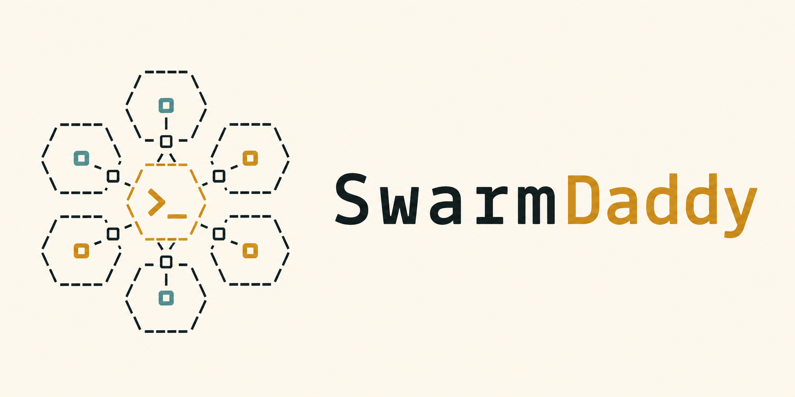

# SwarmDaddy



`SwarmDaddy` is a Claude Code plugin for running Beads-backed multi-agent
workflows. It turns a plan, research question, design question, review target,
or brainstorm topic into a structured swarm run with explicit roles,
checkpoints, telemetry, and backend routing across Claude and Codex.

The plugin has two main modes:

- **Implementation runs** with `/swarmdaddy:do`: inspect a phased plan, create
  Beads issues, dispatch research/analysis/clarify/writer/spec-review/review/docs
  roles, use worktrees for writer units, and finish with one consolidated PR.
- **Output-only runs** with `/swarmdaddy:brainstorm`, `/swarmdaddy:research`,
  `/swarmdaddy:design`, and `/swarmdaddy:review`: gather evidence or judgment and
  close with notes. These profiles do not create writer branches or PRs.

## Requirements

- Claude Code with this plugin installed and reloaded.
- `bd` on `PATH`. Swarm runs require an existing Beads rig in the target repo.
- Python 3.10 or newer for the helper CLIs.
- `git` for implementation runs that create branches and worktrees.
- Backend CLIs for the lanes you enable: `claude` for Claude-backed stages,
  `codex` for Codex-backed stages, and optional `mco` for MCO provider stages.
  Internal `swarm-review` provider shims use the same local CLIs but are
  eligible only after their read-only Phase 0 checks pass. Stock review-capable
  pipelines include the internal provider-review stage; it records a clean
  skipped artifact when no shim is eligible. Once a shim is eligible, one
  provider is enough to collect evidence, but single-provider findings stay
  `needs-verification`.
- Optional TUI dependencies are managed by `bin/swarm-tui` on first launch.

The plugin never initializes Beads implicitly. Run `/swarmdaddy:init-beads` only
when you have decided the current repo should get a `.beads/` store.

## Quick Start

1. Install or refresh the plugin from Claude Code:

   ```text
   /plugin marketplace update mstefanko-plugins
   /plugin install swarmdaddy@mstefanko-plugins
   /reload-plugins
   ```

2. In the repo where you want to run a swarm, initialize Beads if needed:

   ```text
   /swarmdaddy:init-beads
   ```

3. Check the active routing profile:

   ```bash
   "${CLAUDE_PLUGIN_ROOT}/bin/swarm" preset list
  "${CLAUDE_PLUGIN_ROOT}/bin/swarm" providers doctor
  "${CLAUDE_PLUGIN_ROOT}/bin/swarm" providers doctor --review
   "${CLAUDE_PLUGIN_ROOT}/bin/swarm" permissions check
   ```

4. Pick a command:

   ```text
   /swarmdaddy:do docs/my-plan.md --decompose=inspect
   /swarmdaddy:research "How does auth state flow through this repo?"
   /swarmdaddy:design docs/cache-redesign-question.md
   /swarmdaddy:review main..feature/my-branch
   /swarmdaddy:brainstorm "Safer migration paths for the telemetry schema"
   ```

5. Resume interrupted implementation work by Beads epic id:

   ```text
   /swarmdaddy:resume bd-123
   /swarmdaddy:resume bd-123 --merge
   ```

## Choosing A Profile

Fresh installs have no active preset. With no active preset, `/swarmdaddy:do`
uses the `default` pipeline and route resolution falls back to
`${CLAUDE_PLUGIN_DATA}/backends.toml` and built-in role defaults.

Use `bin/swarm mode <name>` or `bin/swarm preset load <name>` to activate a
stock preset:

- `balanced`: standard implementation pipeline with automatic provider-review
  evidence when an eligible read-only shim is available.
- `claude-only`: force all mutable orchestration through Claude.
- `codex-only`: route supported roles through Codex where allowed by invariants.
- `lightweight`: lower-cost implementation routing with the same best-effort
  provider-review evidence point.
- `ultra-plan`: wider planning/exploration before writing, then best-effort
  provider-review evidence before final review.
- `hybrid-review`: standard implementation plus an opt-in Codex review lane.
- `mco-review-lab`: experimental read-only MCO provider evidence before review.
- `competitive`: manual Pattern 5 setup for two-writer trials.
- `brainstorm`, `research`, `design`, `review`: output-only command profiles;
  `review` collects provider-review evidence before final synthesis when an
  eligible shim is available.

Useful profile commands:

```bash
bin/swarm preset list
bin/swarm preset load balanced
bin/swarm preset clear
bin/swarm mode research
bin/swarm preset dry-run hybrid-review docs/my-plan.md
bin/swarm compete docs/my-plan.md --dry-run
bin/swarm compete docs/my-plan.md
```

`bin/swarm compete <plan-path>` validates and activates the `competitive`
preset. It does not dispatch by itself; after it succeeds, run
`/swarmdaddy:do <plan-path>`.

## Slash Commands

- `/swarmdaddy:do <plan-path> [flags]`: run the implementation pipeline.
  Supported flags include `--codex-review auto|on|off`,
  `--risk low|moderate|high`, `--decompose=off|inspect|enforce`,
  `--force-simple <phase_id>`, `--force-decompose <phase_id>`, and `--auto`.
- `/swarmdaddy:brainstorm <topic-or-path> [--dry-run]`: output-only divergent
  exploration with a synthesis note.
- `/swarmdaddy:research <question-or-path> [--dry-run]`: output-only evidence
  gathering with a research memo.
- `/swarmdaddy:design <question-or-path> [--dry-run]`: output-only design
  exploration with an execution-ready recommendation.
- `/swarmdaddy:review <branch-pr-diff-or-path> [--dry-run]`: output-only review
  with findings, checks, risk, and gaps.
- `/swarmdaddy:init-beads`: explicit, idempotent `bd init --stealth` bootstrap.
- `/swarmdaddy:resume <bd-id> [--merge]`: resume from a Beads epic/run issue.

There is no shipped `/swarmdaddy:debug`, `/swarmdaddy:help`, or
`/swarmdaddy:compete` slash command. Use the role and CLI surfaces documented
here instead.

## What Happens In `/swarmdaddy:do`

1. Preflight checks Beads, preset budget, rollout status, permissions, and
   provider readiness.
2. `bin/swarm plan inspect` prepares the run and classifies phases.
3. If decomposition is enabled, each phase is converted into a
   `work_units.v2` artifact and linted before writer/spec-review issues exist.
4. The active pipeline is resolved into topological layers. Stages in the same
   layer can run in parallel.
5. Writer work uses isolated unit branches/worktrees. Spec-review approval is
   required before merging a unit into the integration branch.
6. Review and docs lanes run after implementation evidence exists.
7. Completed units write checkpoints; `/swarmdaddy:resume` uses Beads id plus
   run-event mappings to find the right resume point.
8. A clean full run ends with one consolidated PR into `main`.

## Output-Only Profiles

Output-only profiles use the same preset, pipeline, role, permission, and
telemetry infrastructure but intentionally stop before implementation. They are
good for questions where you want a swarm's evidence or judgment without code
changes.

- `brainstorm`: directions, tradeoffs, fast checks, and open questions.
- `research`: sourced evidence memo with conflicts, gaps, and constraints.
- `design`: recommendation, tradeoffs, execution plan, risks, and open
  questions.
- `review`: verdict, checks run, findings, production risk, and gaps.

Each command has a matching `bin/swarm <profile> --dry-run` helper for graph and
budget validation.

## CLI Reference

`bin/swarm` is the main deterministic helper CLI:

```bash
bin/swarm preset list
bin/swarm preset load <name>
bin/swarm preset clear
bin/swarm preset save <new-name> --from <current|preset-name>
bin/swarm preset diff <name>
bin/swarm preset rename <old-name> <new-name>
bin/swarm preset delete <name>
bin/swarm preset dry-run <name> <plan-path>

bin/swarm pipeline list
bin/swarm pipeline show <name>
bin/swarm pipeline lint <name-or-path>
bin/swarm pipeline fork <source> <name> [--with-preset <preset>]
bin/swarm pipeline set <name>
bin/swarm pipeline diff <name>
bin/swarm pipeline drift <name>

bin/swarm mode claude-only|codex-only|balanced|brainstorm|research|design|review|custom
bin/swarm providers doctor [--preset <name|current>] [--review] [--mco] [--mco-timeout-seconds N] [--json]
bin/swarm providers calibrate-consensus <samples.json> [--output <report.json>] [--json]
bin/swarm permissions check [--role <role>] [--scope repo|user] [--path <settings.json>]
bin/swarm permissions install --role <role> [--dry-run] [--rollback] [--scope repo|user] [--path <settings.json>]

bin/swarm status
bin/swarm rollout show [--json]
bin/swarm rollout dogfood [--notes "..."]
bin/swarm rollout set <path> <value>
bin/swarm rollout history

bin/swarm brainstorm [<topic-or-path>] [--dry-run]
bin/swarm research [<question-or-path>] [--dry-run]
bin/swarm design [<question-or-path>] [--dry-run]
bin/swarm review [<target>] [--dry-run]
bin/swarm compete <plan-path> [--preset competitive] [--dry-run]

bin/swarm resume <bd-id> [--merge] [--json]
bin/swarm handoff <issue-id> --to claude|codex
bin/swarm cancel <issue-id>

bin/swarm run-state write --json-file <path|->
bin/swarm run-state checkpoint [--source <name>] [--reason <name>]
bin/swarm run-state clear

bin/swarm plan inspect <plan-path> [--phase <id>] [--json] [--no-write]
bin/swarm plan decompose <plan-path> --phase <id> [--write <path>] [--bd-epic-id <id>] [--allow-rejected] [--json]

bin/swarm work-units lint <artifact>
bin/swarm work-units migrate <artifact> [--in-place]
bin/swarm work-units ready <artifact> [--state-json-file <path>] [--json]
bin/swarm work-units batches <artifact> [--parallelism <n>] [--state-json-file <path>] [--json]
bin/swarm work-units resume-point <artifact> [--state-json-file <path>] [--json]

bin/swarm worktrees names --run-id <run-id> [--unit-id <unit-id>] [--repo <repo>] [--json]
bin/swarm worktrees ensure-integration --run-id <run-id> [--repo <repo>] [--base-ref <ref>] [--json]
bin/swarm worktrees add-unit --run-id <run-id> --unit-id <unit-id> [--repo <repo>] [--base-ref <ref>] [--json]
bin/swarm worktrees merge --integration-branch <branch> --unit-branch <branch> [--repo <repo>] [--json]
```

Additional helpers:

- `bin/swarm-validate <preset> [--plan <path>]`: preset/pipeline gate shim.
- `bin/swarm-run --backend claude|codex --issue <bd-id> [...]`: manual single
  role fallback runner for writer/spec-review/review/codex-review lanes.
- `bin/swarm-gpt`, `bin/swarm-claude`, `bin/swarm-gpt-review`: convenience
  aliases over `swarm-run`.
- `bin/swarm-provider-review`: internal read-only provider evidence runner.
- `bin/swarm providers evidence <provider-findings.json>`: bounded downstream
  prompt summary for provider-review artifacts.
- `bin/swarm providers calibrate-consensus <samples.json>`: measures labeled
  provider-review samples for secondary-cluster false merges/splits.
- `bin/swarm-stage-mco`: provider-stage helper used by MCO pipeline stages.
- `bin/extract-phase.sh`: findings extraction shim.
- `bin/swarm-telemetry`: telemetry inspection and maintenance CLI.
- `bin/swarm-tui`: optional Textual operator console.

## Data And Configuration

In Claude Code, writable plugin state lives under `${CLAUDE_PLUGIN_DATA}`.
Important paths:

- `${CLAUDE_PLUGIN_DATA}/current-preset.txt`: active preset name.
- `${CLAUDE_PLUGIN_DATA}/backends.toml`: fallback role routing overrides.
- `${CLAUDE_PLUGIN_DATA}/presets/` and `pipelines/`: user-owned forks.
- `${CLAUDE_PLUGIN_DATA}/telemetry/*.jsonl`: runs, findings, outcomes,
  adjudications, run events, observations, and knowledge ledgers.
- `${CLAUDE_PLUGIN_DATA}/active-run.json`: dispatcher-owned active run state.
- `${CLAUDE_PLUGIN_DATA}/runs/<run_id>/checkpoint.v1.json`: resume checkpoints.
- `${CLAUDE_PLUGIN_DATA}/in-flight/*.lock`: running backend process locks.
- `${CLAUDE_PLUGIN_DATA}/provider-review-doctor-cache.json`: latest provider
  doctor selection data used by dry-run budget estimates when available.

From a development shell where `CLAUDE_PLUGIN_DATA` is not set, most pipeline
helpers use the repo's `data/` directory as a local fallback.

## Presets, Pipelines, And Prompt Lenses

Stock presets live in `presets/`; stock pipelines live in `pipelines/`. User
forks are written to `${CLAUDE_PLUGIN_DATA}/presets/` and
`${CLAUDE_PLUGIN_DATA}/pipelines/`.

Pipelines support these stage shapes:

- `agents`: one or more role agents in a stage.
- `fan_out`: multiple branches of one role, optionally with prompt variants or
  model routes, followed by a merge agent.
- `provider`: read-only evidence stages. `swarm-review` is the internal
  runner; `mco` remains the experimental comparison path.

Prompt lenses are cataloged overlays for specific roles and pipeline positions.
Fan-out prompt variants and single-agent `lens` overlays are validated against
the catalog before a pipeline can activate.

## Permissions

Role permission fragments live in `permissions/`. The default repo-scope target
is `.claude/settings.local.json` in the current repo; user scope targets
`~/.claude/settings.local.json`.

Always inspect before installing:

```bash
bin/swarm permissions check --role writer --scope repo
bin/swarm permissions install --role writer --scope repo --dry-run
bin/swarm permissions install --role writer --scope repo
```

Use `--role provider-review` for the internal read-only provider runner profile.

`--rollback` removes that role fragment's rules from the target settings file.

## TUI

`bin/swarm-tui` launches the optional operator console. On first launch it
creates or updates a managed virtualenv under `${CLAUDE_PLUGIN_DATA}/tui/.venv`
from `tui/requirements.lock`. Set `SWARM_TUI_AUTO_INSTALL=1` for
non-interactive bootstrap in a dev shell.

The TUI reads the same telemetry, preset, pipeline, provider, and in-flight
state as the CLI. See `tui/README.md` for screen-specific controls.

## Telemetry

`bin/swarm-telemetry` reports and maintains JSONL ledgers:

```bash
bin/swarm-telemetry dump <ledger>
bin/swarm-telemetry validate [<ledger>]
bin/swarm-telemetry query '<sql>'
bin/swarm-telemetry report [--since Nd] [--role R] [--bucket K]
bin/swarm-telemetry sample-for-adjudication --count N [--since Nd] [--output-root PATH]
bin/swarm-telemetry join-outcomes [--since Nd] [--repo PATH] [--dry-run]
bin/swarm-telemetry purge --older-than Nd [--ledger <ledger>] [--dry-run]
```

<!-- BEGIN: generated-by swarm_do.telemetry.gen readme-section -->
| Subcommand | What it does |
|------------|--------------|
| `dump` | Pretty-print a JSONL ledger as a JSON array. |
| `join-outcomes` | Correlate findings with post-merge maintainer actions. |
| `purge` | Purge rows older than retention window |
| `query` | Execute SQL against all ledgers loaded into sqlite3 :memory:. |
| `report` | Stratified markdown report from runs.jsonl. |
| `sample-for-adjudication` |  Stratified random sample of non-adjudicated findings. |
| `validate` | Validate every ledger row against its JSON schema. |
<!-- END: generated-by swarm_do.telemetry.gen readme-section -->

Self-test:

```bash
bin/swarm-telemetry --test
bin/swarm-telemetry --test --check-docs
```

## Findings Extraction

`bin/extract-phase.sh` is a thin shim over
`python3 -m swarm_do.telemetry.extractors`.

```bash
bin/extract-phase.sh <findings-json-or-notes-md> <run-id> <role> <issue-id>
bin/extract-phase.sh --test
```

Role dispatch:

| Role | Extractor |
|------|-----------|
| `agent-codex-review` | Parses Codex `findings.json` payloads. |
| `agent-review`, `agent-code-review` | Parses reviewer markdown notes. |
| Any other role | Skipped with a warning and exit 0. |

Finding hashes use the stable four-field payload
`file_normalized|category_class|line_bucket|short_summary` so cross-backend
deduplication remains stable.

## Roles

Roles are the personas the swarm pipeline dispatches to. This inventory is
generated from `role-specs/`; edit specs, then run
`PYTHONPATH=py python3 -m swarm_do.roles gen readme-section --write`.

<!-- BEGIN: generated-by swarm_do.roles gen readme-section -->
| Name | Description | Consumers |
|------|-------------|-----------|
| `agent-analysis-judge` | Competitive analysis judge. Reads two competing agent-analysis outputs for the same task and produces a single authoritative work breakdown. Run after BOTH analysis instances close. Allowed to open source files only for items flagged UNVERIFIED in either analysis — reads notes, not files. | agents |
| `agent-analysis` | Swarm pipeline planner. Evaluates approaches and produces a concrete work breakdown for the writer. Trusts research notes — only opens source files for items marked UNVERIFIED. Runs in parallel with agent-clarify after research closes. | agents |
| `agent-brainstorm` | Output-only ideation agent. Generates divergent options, tradeoffs, and synthesis notes without producing an implementation plan, writer handoff, branch, or PR. | agents |
| `agent-clarify` | Swarm pipeline pre-flight checker. Reads research notes via bd show only — no source file access. Surfaces blockers and ambiguities before implementation begins. Runs in parallel with agent-analysis after research closes. | agents |
| `agent-code-review` | Thorough code reviewer combining Chain-of-Verification discipline with multi-domain analysis (quality, security, performance, design). Use for post-writer pipeline verification or standalone PR/branch/module reviews. | agents |
| `agent-code-synthesizer` | Code synthesis agent. Reads two completed writer implementations with complementary approach constraints and cherry-picks the best elements from each into a single unified implementation. Operates at function/method level only — never mixes within a single function or across incompatible data structures. Used in Pattern 6 — Code Synthesis. | agents |
| `agent-codex-review-phase0` | Cross-model reviewer (GPT-5.4 via Codex CLI). Specialized for blocking-issues only — types, null/nil edges, off-by-one, boundary conditions, parser/serializer mismatches, security boundaries. Invoked manually during Phase 0 validation. | agents |
| `agent-codex-review` | Blocking-issues-only pipeline reviewer (backend-neutral contract). Runs in the post-spec-review quality lane focused on types, null/edge cases, off-by-one, boundary conditions, and security-relevant bugs. | agents, roles-shared |
| `agent-debug` | Swarm pipeline bug analyzer. Replaces agent-analysis for phases tagged kind=bug. Produces a root-cause-first work breakdown — trigger, call chain, fix location, defense-in-depth — never symptom patches. | agents |
| `agent-decompose` | Bounded planner that converts one inspected plan phase into a schema-strict work_units.v2 artifact. | agents |
| `agent-docs` | Swarm pipeline documentation updater. Edits .md files and doc comments only — no source code. Reads writer notes to understand what changed before editing anything. Runs in parallel with agent-review after writer closes. | agents |
| `agent-research-merge` | Synthesizes parallel sub-research outputs into a single unified research report. Runs after all sub-researchers close, before clarify and analysis. Reads only beads notes — no source file access except for items explicitly flagged UNVERIFIED by sub-researchers. | agents |
| `agent-research` | Swarm pipeline fact-finder. Reads codebase, searches memory, gathers raw findings. No opinions or recommendations — pure discovery. Use at the start of a swarm pipeline before analysis or clarify. | agents |
| `agent-review` | Swarm pipeline verifier. Runs tests and confirms implementation matches analysis intent. Flags issues in notes only — does not edit files. Runs in parallel with agent-docs after writer closes. | agents, roles-shared |
| `agent-spec-review` | Swarm pipeline spec-compliance checker. Confirms the writer's code matches the work breakdown from analysis. Does NOT evaluate code quality — that is agent-review's job. Fast reject on acceptance-criteria mismatch. | agents, roles-shared |
| `agent-writer-judge` | Competitive implementation judge. Reads two completed writer implementations, evaluates using execution signals and code quality criteria, and selects the winning implementation. Primary decision criterion is test results (objective). Secondary criteria are edge case coverage, code quality, and pattern adherence. Used in Pattern 5 — Competitive Implementation. | agents |
| `agent-writer` | Swarm pipeline executor. Implements exactly what agent-analysis specified. Holds the merge slot for the duration of work. Reads analysis and clarify notes before writing any code. | agents, roles-shared |
<!-- END: generated-by swarm_do.roles gen readme-section -->

## Testing

The current Python suite uses `unittest` and covers pipeline validation,
preset/pipeline persistence, telemetry parity and golden files, role
generation, work-unit execution helpers, worktrees, provider doctoring, resume
state, and TUI state helpers.

Run the full suite from the repo root:

```bash
PYTHONPATH=py python3 -m unittest discover -s py -p 'test_*.py'
```

Check generator-backed docs:

```bash
PYTHONPATH=py python3 -m swarm_do.roles gen readme-section --check
PYTHONPATH=py python3 -m swarm_do.telemetry.gen readme-section --check
PYTHONPATH=py python3 -m swarm_do.telemetry.gen docs --check
```

The current recommendation is not a wholesale pytest migration. Keep
`unittest` as the baseline until a dev dependency story is added, then adopt
pytest incrementally for the places where it buys real coverage: CLI scenario
fixtures, Textual async interaction tests, shell wrapper smoke tests, coverage
reporting, and property tests for parsers. See `docs/testing-strategy.md` for
the assessment and proposed refactor path.

## Development Notes

- Edit the marketplace clone, not the install cache. The cache under
  `~/.claude/plugins/cache/.../swarmdaddy/` is overwritten by marketplace
  updates. Make code changes in the marketplace/worktree clone, commit, push,
  then run `/plugin marketplace update mstefanko-plugins` and `/reload-plugins`.
- Do not hand-edit generated README sections bounded by
  `<!-- BEGIN/END: generated-by ... -->` markers. Run the listed generators.
- Do not add role files, command bodies, or runner scripts that depend directly
  on claude-mem internals. Memory stays pluggable through skill surfaces and
  dispatcher-produced artifacts.
- Keep Beads coupling explicit and disciplined. `bin/_lib/beads-preflight.sh`
  is the single shared shell preflight helper.
- Do not auto-init Beads from a hook, subagent, or run helper.

Historical migration and provenance notes live under `docs/history/` and
`docs/provenance/`. They are audit references, not setup instructions for new
users.
