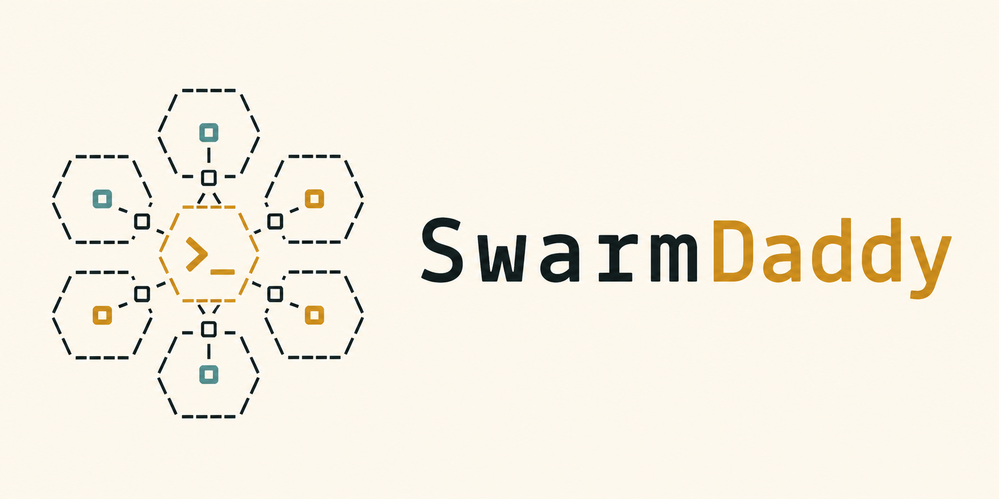
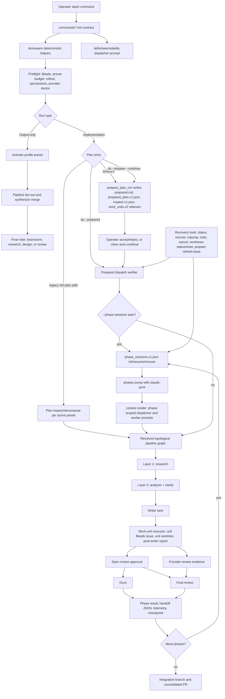

# SwarmDaddy



`SwarmDaddy` is a Claude Code plugin for running Beads-backed multi-agent
workflows. It turns a plan, research question, design question, review target,
or brainstorm topic into a structured swarm run with explicit roles,
checkpoints, telemetry, and backend routing across Claude and Codex.

The plugin has two main modes:

- **Implementation runs** with `/swarmdaddy:do`: prepare or verify a phased
  plan, create Beads issues only after the dispatch gate is clean, dispatch
  research/analysis/clarify/writer/spec-review/review/docs roles, use
  phase-scoped context and worktrees for writer units, and finish with one
  consolidated PR.
- **Output-only runs** with `/swarmdaddy:brainstorm`, `/swarmdaddy:research`,
  `/swarmdaddy:design`, and `/swarmdaddy:review`: gather evidence or judgment and
  close with notes. These profiles do not create writer branches or PRs.

## Requirements

- Claude Code with this plugin installed and reloaded.
- `bd` on `PATH`. Swarm runs require an existing Beads rig in the target repo.
- Python 3.10 or newer for the helper CLIs.
- `git` for implementation runs that create branches and worktrees.
- Backend CLIs for the lanes you enable: `claude` for Claude-backed stages,
  `codex` for Codex-backed stages, and optional `mco` for MCO provider stages.
  Internal `swarm-review` provider shims use the same local CLIs but are
  eligible only after provider doctor gates pass for installed CLI, native
  schema support, read-only proof, and auth readiness. Stock review-capable
  pipelines include the internal provider-review stage; it records a clean
  skipped artifact when no shim is eligible. Once a shim is eligible, one
  provider is enough to collect evidence, but single-provider findings stay
  `needs-verification`.
- The recommended configuration UI is `/swarmdaddy:configure`, backed by
  `bin/swarm-tui`. It manages presets, routes, provider readiness, and
  active-run status; its optional Textual dependencies are installed into a
  managed venv on first launch.

The plugin never initializes Beads from `/swarmdaddy:configure`.
Run `/swarmdaddy:quickstart` for guided first-run setup, or
`/swarmdaddy:init-beads` when you only want the explicit Beads bootstrap.

## Quick Start

1. Install or refresh the plugin from Claude Code:

   ```text
   /plugin marketplace update mstefanko-plugins
   /plugin install swarmdaddy@mstefanko-plugins
   /reload-plugins
   ```

2. In the repo where you want to run a swarm, use the guided path:

   ```text
   /swarmdaddy:quickstart
   ```

   It initializes Beads when missing, migrates old user pipeline files into
   unified presets, prints the active state, and opens the TUI.

3. Run the next command:

   ```text
   /swarmdaddy:do docs/my-plan.md --decompose=inspect
   ```

4. Optional checks:

   ```bash
   "${CLAUDE_PLUGIN_ROOT}/bin/swarm" preset list
   "${CLAUDE_PLUGIN_ROOT}/bin/swarm" providers doctor
   "${CLAUDE_PLUGIN_ROOT}/bin/swarm" providers doctor --review
   "${CLAUDE_PLUGIN_ROOT}/bin/swarm" sessions doctor
   "${CLAUDE_PLUGIN_ROOT}/bin/swarm" permissions check
   ```

5. Open the inspect-only TUI later to customize presets, inspect routes, and run
   provider doctor from the same configuration view:

   ```text
   /swarmdaddy:configure
   ```

   The slash command delegates to:

   ```bash
   "${CLAUDE_PLUGIN_ROOT}/bin/swarm-tui"
   ```

   In cmux, the launcher opens the TUI in a right split pane. On first launch,
   approve the managed venv install prompt. In non-interactive dev shells, use
   `SWARM_TUI_AUTO_INSTALL=1 "${CLAUDE_PLUGIN_ROOT}/bin/swarm-tui"`.

6. Other dispatch commands:

   ```text
   /swarmdaddy:do docs/my-plan.md --decompose=inspect
   /swarmdaddy:research "How does auth state flow through this repo?"
   /swarmdaddy:design docs/cache-redesign-question.md
   /swarmdaddy:review main..feature/my-branch
   /swarmdaddy:brainstorm "Safer migration paths for the telemetry schema"
   ```

7. Resume interrupted implementation work by Beads epic id:

   ```text
   /swarmdaddy:resume bd-123
   /swarmdaddy:resume bd-123 --merge
   ```

## Phase Sessions

Accepted prepared artifacts can be advanced one phase at a time through durable
phase-session state:

```bash
bin/swarm phases doctor <run-id> --json
bin/swarm phases status <run-id>
bin/swarm phases init <run-id>
bin/swarm phases recover <run-id> --json --dry-run
bin/swarm phases recover <run-id>
bin/swarm phases status <run-id> --attempts --include-archived
bin/swarm phases pump <run-id> --launcher manual --max-phases 1
bin/swarm phases pump <run-id> --launcher claude-print --max-phases all --init
bin/swarm do --prepared <run-id> --phase-sessions auto
bin/swarm context render --run-id <run-id> --phase <phase-id> --role dispatcher --json
```

`phases recover` reconciles existing phase-session state without launching a
new child. The foreground pump and `do --prepared ... --phase-sessions auto`
run the same reconciliation before claiming work, so rerunning them after an
interruption adopts valid artifacts, preserves abandoned-attempt evidence, and
does not retry blocked or input-gated phases.

For an interrupted durable run, use `phases status`, then `phases recover
--dry-run` to inspect the reconciliation, `phases recover` to apply it,
`phases status --attempts --include-archived` to inspect old attempts, and
finally `phases pump` or `do --prepared ... --phase-sessions auto` to continue.
`resume` is read-only and does not mutate phase-session state.

`manual` is the always-available launcher and prints the rendered dispatcher
prompt plus the follow-up result command. `fake-test` is for deterministic unit
tests. `claude-print` is the foreground no-babysitting sequential launcher: it
starts a fresh Claude print session for each accepted phase, validates the
result and handoff artifacts, then advances to the next phase only after a
complete result. It is not a daemon, a parallel scheduler, or a recursive
orchestrator. `bin/swarm do --prepared <run-id> --phase-sessions auto` is the
prepared-run shortcut for the same foreground all-phases pump.

Before using `claude-print`, check local readiness:

```bash
bin/swarm sessions doctor --live
```

Recovery-oriented slash commands wrap the same deterministic helpers:

```text
/swarmdaddy:status <run-id>
/swarmdaddy:repump <run-id>
/swarmdaddy:redo <run-id> [--phase N]
```

Use `status` first when a phase-session run is unclear. It runs phase doctor,
phase status with attempts/cost/events, and worktree status, then reports the
next recommended command. Use `repump` only when doctor is clean and the run
needs one more foreground `claude-print` pump tick. Use `redo` when a phase
needs reset and repump; it runs doctor first and requires an explicit operator
choice before adding stronger worktree rebuild, archive, force, or hard-reset
behavior.

The lower-level recovery commands are useful for automation and careful manual
repair:

```bash
bin/swarm prepare refresh-base <run-id> [--to-head | --to-sha <sha>] [--phase <id>] [--dry-run] [--json]
bin/swarm phases doctor <run-id> [--json]
bin/swarm phases status <run-id> --attempts --cost --events [--json]
bin/swarm phases recover <run-id> [--dry-run] [--json]
bin/swarm phases reset <run-id> --phase <id> [--hard] [--json]
bin/swarm phases redo <run-id> [--phase <id>] [--hard] [--rebuild-worktree] [--archive-branch] [--force] [--json]
bin/swarm phases cancel <run-id> [--phase <id>] [--no-kill] [--json]
bin/swarm phases cleanup <run-id> --generated-artifacts [--phase <id>] [--apply] [--json]
bin/swarm phases archive <run-id> [--label <name>] [--json]
bin/swarm phases evidence <run-id> [--phase <id>] [--attempt N] [--raw-local] [--json]
bin/swarm worktrees status <run-id> [--json]
bin/swarm worktrees reset <run-id> (--discard | --archive-branch) [--force] [--json]
```

## Choosing A Profile

Fresh installs have no active preset. With no active preset, `/swarmdaddy:do`
uses the `default` pipeline and route resolution falls back to
`${CLAUDE_PLUGIN_DATA}/backends.toml` and built-in role defaults.

Most users should manage presets through `/swarmdaddy:configure` or
`bin/swarm-tui`. The CLI commands below are the scriptable equivalents and
remain useful for checks, automation, and recovery.

Use `bin/swarm preset load <name>` to activate a stock or user preset:

- `balanced`: recommended everyday implementation profile. It keeps one writer,
  preserves provider-review evidence, and routes only low-risk roles through
  Codex.
- `lightweight`: small/local edits where the lower-cost graph is enough; it
  keeps the same best-effort provider-review evidence point.
- `hybrid-review`: high-confidence or higher-risk implementation profile that
  feeds provider-review and fail-open Codex review evidence into final review.
- `repair-loop`: bounded implementation profile with one clean-context review
  and revision cycle before the normal review lanes.
- `ultra-plan`: wider planning/exploration before writing, then best-effort
  provider-review evidence before final review.
- `claude-only`: diagnostic/repro profile that forces every role through Claude.
- `codex-only`: operational fallback that routes supported roles through Codex
  where allowed by invariants.
- `mco-review-lab`: experimental read-only MCO provider evidence before review.
- `competitive`: opt-in alternative-generation lab for two-writer trials, not a
  production default.
- `smart-friend`: experimental advisor-stage profile that preserves one
  mutating writer.
- `large-project-manager`: experimental large-phase profile using
  `repair-loop` plus `decompose.mode="inspect"`.
- `brainstorm`, `research`, `codebase-map`, `research-orchestrator`, `design`,
  `review`, `review-strict`: output-only command profiles; review profiles
  collect provider-review evidence before final synthesis when an eligible shim
  is available.
  `research-orchestrator` is currently v1-parity with `research` while keeping
  a distinct preset name for future subquestion/source-quality orchestration.

Useful profile commands:

```bash
bin/swarm preset list
bin/swarm preset load balanced
bin/swarm preset clear
bin/swarm preset dry-run hybrid-review docs/my-plan.md
bin/swarm compete docs/my-plan.md --dry-run
bin/swarm compete docs/my-plan.md
```

`bin/swarm mode <name>` is a deprecated alias of
`bin/swarm preset load <name>`.

`bin/swarm compete <plan-path>` validates and activates the `competitive`
preset. It does not dispatch by itself; after it succeeds, run
`/swarmdaddy:do <plan-path>`.

## TUI Configuration Console

Launch the TUI from the installed plugin:

```text
/swarmdaddy:configure
```

The slash command delegates to the launcher:

```bash
"${CLAUDE_PLUGIN_ROOT}/bin/swarm-tui"
```

From this repository checkout, `bin/swarm-tui` works as well. The wrapper sets
`CLAUDE_PLUGIN_ROOT`, uses `${CLAUDE_PLUGIN_DATA}/tui/.venv` for its managed
Textual environment, installs `tui/requirements.lock` when needed, and then
runs `python -m swarm_do.tui.app`. When `CMUX_WORKSPACE_ID` is present and
`cmux` is on `PATH`, it opens the TUI in a right split pane and reuses an
already-running pane instead of spawning duplicates. Without cmux or an
interactive terminal, it prints the terminal command to run manually.

Use the TUI as the main place to manage swarm configuration:

| Screen | Key | What You Can Do |
|--------|-----|-----------------|
| Dashboard | `1` | See active preset, in-flight runs, token burn, latest checkpoint/observation, open the run's Beads issue, request handoff, cancel a running `swarm-run`, or run `Ctrl+H` health. |
| Presets | `3` | Browse stock/user presets, activate a preset, inspect Overview/Graph/Routing/Budget & Policy tabs, edit user presets, view diffs, and run `Ctrl+H` provider doctor. |
| Settings | `4` | Inspect global route defaults and edit base or user-preset route overrides with invariant checks. |

Important workflow details:

- Stock presets are read-only. Press `A` on a stock preset to create a
  stock-ref user preset and activate it for the next `/swarmdaddy:do`.
- User presets can follow a stock graph or carry an inline graph snapshot.
  Graph edits on a stock-following user preset first detach it to an inline
  snapshot; routing and budget edits keep the stock graph reference.
- Press `Ctrl+H` (formerly `Ctrl+D`) to run provider doctor before activation.
- The TUI manages configuration and active-run operations. Starting a new swarm
  run still happens through `/swarmdaddy:*` slash commands after you activate
  the desired profile.
- `/swarmdaddy:setup` is deprecated. Use `/swarmdaddy:quickstart` for first-run
  bootstrap or `/swarmdaddy:configure` for the inspect-only TUI.
- The Presets workbench can author new user presets with inline pipelines
  (`pipeline_inline`) directly: press `N` for the New Preset modal (with a
  preview, validation status, and a Create & Activate fast path) or `M` to
  apply a stock stack to an inline graph. See `tui/README.md` for the full
  keystroke reference.

Top-level navigation: `1` dashboard, `2` runs, `3` presets, `4` settings,
`q` quit. See `tui/README.md` for the full key map.

## Provider Review Versus MCO

SwarmDaddy has two provider evidence paths. New work should normally use the
internal provider-review stage; MCO remains an opt-in comparison lab.

| Path | Graph field | Helper | When it appears | Contract |
|------|---------------|--------|-----------------|----------|
| Internal provider review | `provider.type: swarm-review` | `bin/swarm-provider-review` | The `default` graph and presets that select it (`balanced`, `claude-only`, `codex-only`), plus `lightweight`, `ultra-plan`, and output-only `review` | Swarm-owned v2 artifact, native-schema Claude/Codex shims, read-only gated, evidence-only |
| MCO comparison path | `provider.type: mco` | `bin/swarm-stage-mco` | `mco-review-lab` only | External `mco review` adapter, v1 artifact, experimental comparison path |

In implementation graphs, the internal stage runs after `writer` and before
the final `agent-review`. In output-only `review`, it runs before the review
synthesis. It uses `selection: auto` in stock presets, so provider doctor
chooses only eligible read-only shims. If no shim is eligible, the stage
succeeds with a skipped provider artifact instead of blocking the run.

Provider findings are not quality gates by themselves. They are normalized,
deduplicated evidence for the downstream reviewer. A single provider can
produce useful evidence, but it stays `needs-verification`; only conservative
agreement can become stronger later.

Useful commands:

```bash
bin/swarm providers doctor --review
bin/swarm providers doctor --mco
bin/swarm providers doctor --review --mco
bin/swarm providers evidence <provider-findings.json>
```

The 2026-04-26 local Codex R2 and Claude R3 proof record lives in
`docs/provider-review-r2-r3-proof-2026-04-26.md`. Re-run those opt-in fixtures
only after material local CLI or command-contract drift.

## Slash Commands

- `/swarmdaddy:do <plan-path> [flags]`: run the implementation pipeline.
  Supported flags include `--codex-review auto|on|off`,
  `--risk low|moderate|high`, `--decompose=off|inspect|enforce`,
  `--force-simple <phase_id>`, `--force-decompose <phase_id>`, and `--auto`.
  Add `--prepare --continue` only when the plan is low-risk enough for the
  helper to auto-accept a clean deterministic prepare artifact; it stops with
  `Status: NEEDS_INPUT` whenever operator review is required.
- `/swarmdaddy:prepare <plan-path> [--dry-run]`: produce `prepared.md`, a
  prepared-plan artifact, and per-phase `work_units.v2` sidecars, then stop at
  `READY_FOR_ACCEPTANCE`. Use `/swarmdaddy:prepare --accept <run-id>` or
  `--reject <run-id>` as a separate action; prepare never creates writer
  issues, worktrees, merges, or pull requests.
- `/swarmdaddy:configure`: open the TUI configuration console. In cmux it opens
  a right split pane; otherwise it uses the current interactive terminal or
  prints manual launch instructions.
- `/swarmdaddy:quickstart`: guided first-run bootstrap; initializes Beads when
  missing, migrates old user pipelines into presets, prints status, and opens
  the TUI.
- `/swarmdaddy:setup`: deprecated alias for `/swarmdaddy:configure`; does not
  initialize Beads.
- `/swarmdaddy:brainstorm <topic-or-path> [--dry-run]`: output-only divergent
  exploration with a synthesis note.
- `/swarmdaddy:research <question-or-path> [--dry-run]`: output-only evidence
  gathering with a research memo.
- `/swarmdaddy:design <question-or-path> [--dry-run]`: output-only design
  exploration with an execution-ready recommendation.
- `/swarmdaddy:review <branch-pr-diff-or-path> [--dry-run]`: output-only review
  with findings, checks, risk, and gaps.
- `/swarmdaddy:init-beads`: explicit, idempotent `bd init --stealth` bootstrap.
- `/swarmdaddy:resume <bd-id> [--merge]`: resume from a Beads epic/run issue.
- `/swarmdaddy:status <run-id>`: read-only recovery dashboard for a
  phase-session run. Runs phase doctor, phase status with attempts/cost/events,
  and worktree status, then prints the next recommended command when one is
  available.
- `/swarmdaddy:repump <run-id>`: pump one healthy phase-session tick with
  `claude-print`, then show updated attempts/cost/events status.
- `/swarmdaddy:redo <run-id> [--phase N]`: run recovery diagnostics, reset the
  requested phase when safe, and repump. Stronger worktree rebuild/archive,
  force, or hard-reset flags require an explicit operator choice or an
  already-present flag.

There is no shipped `/swarmdaddy:debug`, `/swarmdaddy:help`, or
`/swarmdaddy:compete` slash command. Use the role and CLI surfaces documented
here instead.

## Architecture And End-To-End Flow

SwarmDaddy has a prompt-side dispatcher and a deterministic helper layer. Slash
command files in `commands/` define the operator contract and call
`skills/swarmdaddy/SKILL.md` when a Claude-side orchestration loop is needed.
The helper CLI (`bin/swarm`, backed by `py/swarm_do.pipeline.cli`) owns parsing,
schema validation, preset and pipeline resolution, budget checks, graph
rendering, phase-session state, recovery decisions, context bundles, worktree
operations, and artifact validation. The dispatcher owns the actions Python
cannot take inside Claude Code: creating Beads issues, spawning role agents,
waiting for results, and deciding how to present pauses to the operator.


```mermaid
flowchart TD
    A["Operator slash command"] --> B["commands/*.md contract"]
    B --> C["bin/swarm deterministic helpers"]
    B --> D["skills/swarmdaddy dispatcher prompt"]
    C --> E["Preflight: Beads, preset budget, rollout, permissions, provider doctor"]
    E --> F{"Run type"}

    F -->|Output-only| O1["Activate profile preset"]
    O1 --> O2["Pipeline fan-out and synthesize merge"]
    O2 --> O3["Final note: brainstorm, research, design, or review"]

    F -->|Implementation| P1{"Plan entry"}
    P1 -->|/prepare| P2["prepare_plan_run writes prepared.md, prepared_plan.v1.json, inspect.v1.json, work_units.v2 sidecars"]
    P1 -->|do --prepare --continue| P2
    P1 -->|do --prepared| P4["Prepared dispatch verifier"]
    P1 -->|legacy /do plan path| P3["Plan inspect/decompose per active preset"]
    P2 --> P5["Operator accept/reject, or clean auto-continue"]
    P5 --> P4
    P3 --> G["Resolved topological pipeline graph"]
    P4 --> S{"--phase-sessions auto?"}

    S -->|yes| Q1["phase_sessions.v1.json init/resume/recover"]
    Q1 --> Q2["phases pump with claude-print"]
    Q2 --> Q3["context render: phase-scoped dispatcher and worker prompts"]
    Q3 --> G
    S -->|no| G

    G --> H1["Layer 1: research"]
    H1 --> H2["Layer 2: analysis + clarify"]
    H2 --> H3["Writer lane"]
    H3 --> WU["Work-unit executor: unit Beads issue, unit worktree, post-writer report"]
    WU --> H4["Spec-review approval"]
    WU --> H5["Provider-review evidence"]
    H4 --> H6["Docs"]
    H4 --> H7["Final review"]
    H5 --> H7
    H6 --> I["Phase result, handoff JSON, telemetry, checkpoint"]
    H7 --> I
    I --> J{"More phases?"}
    J -->|yes| Q1
    J -->|no| K["Integration branch and consolidated PR"]

    R["Recovery tools: status, recover, repump, redo, cancel, worktrees status/reset, prepare refresh-base"] --> Q1
    R --> P4
```

The default implementation graph is:

```text
research -> analysis + clarify -> writer -> spec-review + provider-review -> docs + review
```

Stages in the same topological layer can run in parallel. In prepared runs with
`work_units.v2`, the writer/spec-review lane is narrowed to one work unit at a
time or one ready batch at a time: the coordinator creates the unit issue,
creates an isolated unit branch/worktree, launches `agent-writer`, records a
post-writer report, launches `agent-spec-review`, and merges only approved unit
branches into the integration branch. Provider-review stages are read-only
evidence producers; they normalize findings for downstream review but never
approve, reject, merge, or mutate repository files.

State and evidence are intentionally split by responsibility:

- Beads stores the human-readable parent run issue, child issues, dependency
  edges, notes, and handoff requests.
- `${CLAUDE_PLUGIN_DATA}/runs/<run_id>/` stores prepared artifacts,
  phase-session state, rendered context bundles, phase results, handoff JSON,
  provider evidence, worktree manifests, recovery evidence, and checkpoints.
- `${CLAUDE_PLUGIN_DATA}/telemetry/*.jsonl` stores run, finding, outcome,
  observation, and run-event ledgers.
- `${CLAUDE_PLUGIN_DATA}/active-run.json` is the dispatcher-owned current run
  pointer and is cleared only after a clean completion.

## What Happens In `/swarmdaddy:do`

1. The command preflights Beads, active preset budget, rollout status,
   permissions, provider readiness, and phase-session launcher readiness when
   needed. It never initializes Beads implicitly.
2. For new plan paths, the prepare layer writes and validates the prepared
   artifacts. `/swarmdaddy:prepare` stops at `READY_FOR_ACCEPTANCE`; `do
   --prepare --continue` can auto-accept only clean deterministic artifacts.
3. For accepted artifacts, `bin/swarm do --prepared` verifies status, hashes,
   git base, sidecar descriptors, path containment, and work-unit lint before
   any Beads child issue is created.
4. With `--phase-sessions auto`, the durable phase queue initializes or resumes,
   reconciles stale or abandoned attempts, renders phase-scoped context, and
   pumps fresh `claude-print` sessions until completion or a terminal pause.
5. The active preset graph resolves into topological layers. The dispatcher
   creates Beads issues and dependency edges for each stage, fan-out branch,
   merge agent, provider stage, or work unit.
6. The writer/spec-review implementation lane uses isolated unit worktrees when
   a work-unit artifact is present. The coordinator records post-writer
   evidence and merges only `APPROVED` unit branches.
7. Review and docs lanes run after implementation evidence exists. Provider
   evidence is passed as bounded downstream context, not as a quality gate.
8. Each phase writes structured result and handoff artifacts, run events, and
   checkpoints. `/swarmdaddy:resume` is read-only; phase-session mutation happens
   through `bin/swarm phases ...`, `bin/swarm do --prepared ... --phase-sessions
   auto`, or the recovery slash commands.
9. A clean full implementation run ends with one consolidated PR into `main`.

## Two-Step Prepare Gate

`/swarmdaddy:prepare` is the operator-facing gate for bounded work units:

```bash
bin/swarm prepare docs/plan.md
bin/swarm prepare --accept <run-id>
```

The first command writes the prepared artifacts and prints finding counts,
safe-fix summaries, work-unit counts, allowed-file scope, validation commands,
hashes, and git base. The second command re-runs schema, trust-boundary, and
stale checks before flipping the artifact to `accepted`.

Use the two-step flow for high-risk work, advisory findings, any model-labeled
`safe_fix`, inferred hard phases, changed validation commands, changed
allowed-file scopes, or material rewrites. For routine low-risk plans, the
opt-in convenience path is:

```bash
bin/swarm do docs/plan.md --prepare --continue --phase-sessions auto
```

It records the same prepared artifact, auto-accepts only when the deterministic
safety checks pass, dispatches through the same `--prepared` verifier, and then
runs the accepted phases sequentially in fresh `claude-print` sessions. Omit
`--phase-sessions auto` when you want the command to stop at
`READY_FOR_DISPATCH`. If it returns `NEEDS_INPUT`, review the artifact and
continue manually with `bin/swarm prepare --accept <run-id>` followed by
`bin/swarm do --prepared <run-id> --phase-sessions auto`.

## Output-Only Profiles

Output-only profiles use the same preset, pipeline, role, permission, and
telemetry infrastructure but intentionally stop before implementation. They are
good for questions where you want a swarm's evidence or judgment without code
changes.

- `brainstorm`: directions, tradeoffs, fast checks, and open questions.
- `research`: sourced evidence memo with conflicts, gaps, and constraints.
- `design`: recommendation, tradeoffs, execution plan, risks, and open
  questions.
- `review`: verdict, checks run, findings, production risk, and gaps.

Each command has a matching `bin/swarm <profile> --dry-run` helper for graph and
budget validation.

## CLI Reference

`bin/swarm` is the main deterministic helper CLI:

```bash
bin/swarm preset list
bin/swarm preset load <name>
bin/swarm preset clear
bin/swarm preset show <name>
bin/swarm preset resolve <name> [--json]
bin/swarm preset save <new-name> --from <current|preset-name>
bin/swarm preset diff <name>
bin/swarm preset rename <old-name> <new-name>
bin/swarm preset delete <name>
bin/swarm preset dry-run <name> <plan-path>
bin/swarm preset migrate
bin/swarm preset adopt <archived-yaml> --template <stock-preset> [--name <name>]

bin/swarm prepare <plan-path> [--dry-run] [--json]
bin/swarm prepare --accept <run-id> [--accepted-by <name>] [--json]
bin/swarm prepare --reject <run-id> [--reason <text>] [--json]
bin/swarm prepare refresh-base <run-id> [--to-head | --to-sha <sha>] [--phase <id>] [--dry-run] [--json]
bin/swarm do <plan-path> --prepare --continue [--phase-sessions auto] [--json]
bin/swarm do --prepared <run-id-or-artifact-path> [--phase-sessions auto] [--json]
bin/swarm plan prepare <plan-path> [--dry-run] [--write] [--json]
bin/swarm beads check [--repo <path>] [--json]

bin/swarm pipeline list
bin/swarm pipeline show <name>
bin/swarm pipeline lint <name-or-path>
bin/swarm pipeline fork <source> <name> [--with-preset <preset>]
bin/swarm pipeline set <name>
bin/swarm pipeline diff <name>
bin/swarm pipeline drift <name>

bin/swarm providers doctor [--preset <name|current>] [--backend-tier path|version|handshake] [--review] [--mco] [--mco-timeout-seconds N] [--json]
bin/swarm providers evidence <provider-findings.json>
bin/swarm providers calibrate-consensus <samples.json> [--output <report.json>] [--json]
bin/swarm permissions check [--role <role>] [--scope repo|user] [--path <settings.json>]
bin/swarm permissions install [--dry-run] [--scope repo|user] [--path <settings.json>]
bin/swarm selftest [--plan <path>] [--preset <name|current>] [--json] [--strict]
bin/swarm sessions doctor [--launcher manual|fake-test|claude-print|interactive] [--json]

bin/swarm status
bin/swarm rollout show [--json]
bin/swarm rollout dogfood [--notes "..."]
bin/swarm rollout set <path> <value>
bin/swarm rollout history

bin/swarm brainstorm [<topic-or-path>] [--dry-run]
bin/swarm research [<question-or-path>] [--dry-run]
bin/swarm design [<question-or-path>] [--dry-run]
bin/swarm review [<target>] [--dry-run]
bin/swarm compete <plan-path> [--preset competitive] [--dry-run]

bin/swarm resume <bd-id> [--merge] [--json]
bin/swarm handoff <issue-id> --to claude|codex
bin/swarm cancel <issue-id>

bin/swarm run-state write --json-file <path|->
bin/swarm run-state checkpoint [--source <name>] [--reason <name>]
bin/swarm run-state clear

bin/swarm sessions doctor [--live] [--json]
bin/swarm context render --run-id <run-id> --phase <id> --role dispatcher|agent-writer|agent-spec-review|agent-review|agent-docs [--unit <id>] [--max-prompt-bytes N] [--json]

bin/swarm phases init <run-id> [--policy-profile standard|dogfood|strict] [--json]
bin/swarm phases doctor <run-id> [--json]
bin/swarm phases status <run-id> [--cost] [--attempts] [--events] [--include-archived] [--json]
bin/swarm phases claim <run-id> [--reclaim-stale] [--json]
bin/swarm phases start <run-id> --phase <id> --launcher <name> [--lease-owner <id>] [--session-name <name>] [--json]
bin/swarm phases refresh <run-id> --phase <id> --lease-owner <id> [--json]
bin/swarm phases reset <run-id> --phase <id> [--hard] [--json]
bin/swarm phases recover <run-id> [--dry-run] [--json]
bin/swarm phases redo <run-id> [--phase <id>] [--hard] [--rebuild-worktree] [--archive-branch] [--force] [--launcher manual|fake-test|claude-print] [--max-phases 1|all] [--init] [--json]
bin/swarm phases pump <run-id> --launcher manual|fake-test|claude-print [--max-phases 1|all] [--init] [--stop-on-checkpoint] [--json]
bin/swarm phases cancel <run-id> [--phase <id>] [--no-kill] [--json]
bin/swarm phases cleanup <run-id> --generated-artifacts [--phase <id>] [--apply] [--json]
bin/swarm phases archive <run-id> [--label <name>] [--json]
bin/swarm phases evidence <run-id> [--phase <id>] [--attempt N] [--raw-local] [--json]
bin/swarm phases decisions <run-id> add --source-phase <id> --text <text> [--applies-to <id>|--global] [--reason <text>] [--json]
bin/swarm phases complete|fail|block|needs-input <run-id> --phase <id> --json-file <path> [--json]
bin/swarm phases reap <run-id> [--json]

bin/swarm plan inspect <plan-path> [--phase <id>] [--json] [--no-write]
bin/swarm plan decompose <plan-path> --phase <id> [--write <path>] [--bd-epic-id <id>] [--allow-rejected] [--json]
bin/swarm plan accept <run-id> [--accepted-by <name>] [--json]
bin/swarm plan reject <run-id> [--reason <text>] [--json]

bin/swarm work-units lint <artifact>
bin/swarm work-units migrate <artifact> [--in-place]
bin/swarm work-units ready <artifact> [--state-json-file <path>] [--json]
bin/swarm work-units batches <artifact> [--parallelism <n>] [--state-json-file <path>] [--json]
bin/swarm work-units resume-point <artifact> [--state-json-file <path>] [--json]
bin/swarm work-units post-writer <artifact> --unit-id <id> [--repo <repo>] [--base-ref <ref>] [--writer-return-file <path|->] [--emit-run-event] [--run-id <run-id>] [--json]

bin/swarm worktrees names --run-id <run-id> [--unit-id <unit-id>] [--repo <repo>] [--json]
bin/swarm worktrees ensure-integration --run-id <run-id> [--repo <repo>] [--base-ref <ref>] [--allow-source-worktree] [--json]
bin/swarm worktrees add-unit --run-id <run-id> --unit-id <unit-id> [--repo <repo>] [--base-ref <ref>] [--allow-source-worktree] [--json]
bin/swarm worktrees merge --integration-branch <branch> --unit-branch <branch> [--repo <repo>] [--allow-source-worktree] [--json]
bin/swarm worktrees adopt-run <run-id> [--apply] [--json]
bin/swarm worktrees status <run-id> [--json]
bin/swarm worktrees reset <run-id> (--discard | --archive-branch) [--force] [--json]
bin/swarm worktrees integrate-run <run-id> [--apply] [--json]
bin/swarm worktrees cleanup-run <run-id> [--apply] [--json]
```

Run-start dispatch uses a Python-owned preflight gate before it writes
`active-run.json`: Beads rig discovery via `bd where`, provider backend
readiness, launcher eligibility for phase-session runs, active-run conflicts,
and zero git-base defense. Use `bin/swarm preset resolve <name> --json` when
you need the preset-aware graph that dispatch will actually follow.

`cleanup-run` removes only adopted or no-change run worktrees; unadopted,
preserved, and conflicted worktrees stay in place for inspection.

`bin/swarm mode <name>` is a deprecated alias of `bin/swarm preset load <name>`.

Additional helpers:

- `bin/swarm-validate <preset> [--plan <path>]`: preset gate shim.
- `bin/swarm-run --backend claude|codex --issue <bd-id> [...]`: manual single
  role fallback runner for writer/spec-review/review/codex-review lanes.
- `bin/swarm-gpt`, `bin/swarm-claude`, `bin/swarm-gpt-review`: convenience
  aliases over `swarm-run`.
- `bin/swarm-provider-review`: internal read-only provider evidence runner.
- `bin/swarm providers evidence <provider-findings.json>`: bounded downstream
  prompt summary for `swarm-review` v2 artifacts and MCO v1 artifacts.
- `bin/swarm providers calibrate-consensus <samples.json>`: measures labeled
  provider-review samples for secondary-cluster false merges/splits.
- `bin/swarm-stage-mco`: experimental provider-stage helper used only by MCO
  pipeline stages.
- `bin/extract-phase.sh`: findings extraction shim.
- `bin/swarm-telemetry`: telemetry inspection and maintenance CLI.
- `bin/swarm-tui`: recommended Textual configuration console for presets,
  routes, provider doctoring, and active-run status.

## Data And Configuration

In Claude Code, writable plugin state lives under `${CLAUDE_PLUGIN_DATA}`.
Important paths:

- `${CLAUDE_PLUGIN_DATA}/current-preset.txt`: active preset name.
- `${CLAUDE_PLUGIN_DATA}/backends.toml`: fallback role routing overrides.
- `${CLAUDE_PLUGIN_DATA}/presets/`: user-owned presets.
- `${CLAUDE_PLUGIN_DATA}/pipelines/.archived/`: archived legacy user pipeline
  YAML after `bin/swarm preset migrate`.
- `${CLAUDE_PLUGIN_DATA}/telemetry/*.jsonl`: runs, findings, outcomes,
  adjudications, run events, observations, and knowledge ledgers.
- `${CLAUDE_PLUGIN_DATA}/active-run.json`: dispatcher-owned active run state.
- `${CLAUDE_PLUGIN_DATA}/runs/<run_id>/checkpoint.v1.json`: resume checkpoints.
- `${CLAUDE_PLUGIN_DATA}/in-flight/*.lock`: running backend process locks.
- `${CLAUDE_PLUGIN_DATA}/provider-review-doctor-cache.json`: latest provider
  doctor selection data used by dry-run budget estimates when available.

From a development shell where `CLAUDE_PLUGIN_DATA` is not set, most pipeline
helpers use the repo's `data/` directory as a local fallback.

## Presets And Prompt Lenses

Stock presets live in `presets/`; stock graph templates live in `pipelines/`.
User presets live in `${CLAUDE_PLUGIN_DATA}/presets/`. A preset either follows
a stock graph with `pipeline = "default"` or stores an edited graph as a
`[pipeline_inline]` snapshot.

```toml
name = "balanced"
pipeline = "default"

[budget]
max_agents_per_run = 16
max_estimated_cost_usd = 25.0
max_wall_clock_seconds = 14400
```

```toml
name = "my-balanced-edit"
origin = "user"

[budget]
max_agents_per_run = 16
max_estimated_cost_usd = 25.0
max_wall_clock_seconds = 14400

[pipeline_inline]
pipeline_version = 1
name = "default"

[[pipeline_inline.stages]]
id = "research"
depends_on = []
agents = [{ role = "agent-research" }]
```

Preset graphs support these stage shapes:

- `agents`: one or more role agents in a stage.
- `fan_out`: multiple branches of one role, optionally with prompt variants or
  model routes, followed by a merge agent.
- `provider`: read-only evidence stages. `swarm-review` is the internal
  runner used by stock review-capable pipelines; `mco` remains the experimental
  comparison path used by `mco-review-lab`.

Prompt lenses are cataloged overlays for specific roles and pipeline positions.
Fan-out prompt variants and single-agent `lens` overlays are validated against
the catalog before a pipeline can activate.

## Permissions

Role permission fragments live in `permissions/` and are generated from
`role-specs/`. Per-agent tool restrictions live in role frontmatter and the
generated fragments; they are not merged into the dispatcher settings file.
`bin/swarm permissions install` writes only the coordinator minimum allowlist.
The default repo-scope target is `.claude/settings.local.json` in the current
repo; user scope targets `~/.claude/settings.local.json`.

Always inspect before installing:

```bash
bin/swarm permissions check --scope repo
bin/swarm permissions install --scope repo --dry-run
bin/swarm permissions install --scope repo
```

`permissions check` validates role-spec parsing, generated artifact drift, the
coordinator allowlist, and role registry agreement. Its `--role` flag is kept
only for old scripts and does not narrow the check. `permissions install --role`
is intentionally rejected; refresh role artifacts with
`PYTHONPATH=py python3 -m swarm_do.roles gen --write` after editing
`role-specs/`.

## Telemetry

`bin/swarm-telemetry` reports and maintains JSONL ledgers:

```bash
bin/swarm-telemetry dump <ledger>
bin/swarm-telemetry validate [<ledger>]
bin/swarm-telemetry query '<sql>'
bin/swarm-telemetry report [--since Nd] [--role R] [--bucket K]
bin/swarm-telemetry dogfood-check [--batch ID] [--format json|markdown]
bin/swarm-telemetry sample-for-adjudication --count N [--since Nd] [--output-root PATH]
bin/swarm-telemetry join-outcomes [--since Nd] [--repo PATH] [--dry-run]
bin/swarm-telemetry purge --older-than Nd [--ledger <ledger>] [--dry-run]
```

<!-- BEGIN: generated-by swarm_do.telemetry.gen readme-section -->
| Subcommand | What it does |
|------------|--------------|
| `contract-usage` | Role-contract violation report from observations.jsonl × permissions/<role>.json. |
| `dogfood-check` | Advisory HOLD/PROMOTE_CANDIDATE check from dogfood telemetry. |
| `dump` | Pretty-print a JSONL ledger as a JSON array. |
| `experiment-report` | Join runs, observations, and run_events for controlled dogfood scorecards. |
| `join-outcomes` | Correlate findings with post-merge maintainer actions. |
| `purge` | Purge rows older than retention window |
| `query` | Execute SQL against all ledgers loaded into sqlite3 :memory:. |
| `report` | Stratified markdown report from runs.jsonl. |
| `roundtrips` | Per-unit writer/review iteration counts derived from runs.jsonl. |
| `sample-for-adjudication` |  Stratified random sample of non-adjudicated findings. |
| `validate` | Validate every ledger row against its JSON schema. |
<!-- END: generated-by swarm_do.telemetry.gen readme-section -->

Self-test:

```bash
bin/swarm-telemetry --test
bin/swarm-telemetry --test --check-docs
```

## Findings Extraction

`bin/extract-phase.sh` is a thin shim over
`python3 -m swarm_do.telemetry.extractors`.

```bash
bin/extract-phase.sh <findings-json-or-notes-md> <run-id> <role> <issue-id>
bin/extract-phase.sh --test
```

Role dispatch:

| Role | Extractor |
|------|-----------|
| `agent-codex-review` | Parses Codex `findings.json` payloads. |
| `agent-review`, `agent-code-review` | Parses reviewer markdown notes. |
| `swarm-review`, `provider-review` | Down-converts internal provider-review v2 artifacts into standard findings rows. |
| Any other role | Skipped with a warning and exit 0. |

Finding hashes use the stable four-field payload
`file_normalized|category_class|line_bucket|short_summary` so cross-backend
deduplication remains stable.

## Roles

Roles are the personas the swarm pipeline dispatches to. This inventory is
generated from `role-specs/`; edit specs, then run
`PYTHONPATH=py python3 -m swarm_do.roles gen readme-section --write`.

<!-- BEGIN: generated-by swarm_do.roles gen readme-section -->
| Name | Description | Consumers |
|------|-------------|-----------|
| `agent-analysis-judge` | Competitive analysis judge. Reads two competing agent-analysis outputs for the same task and produces a single authoritative work breakdown. Run after BOTH analysis instances close. Allowed to open source files only for items flagged UNVERIFIED in either analysis — reads notes, not files. | agents, permissions |
| `agent-analysis` | Swarm pipeline planner. Evaluates approaches and produces a concrete work breakdown for the writer. Trusts research notes — only opens source files for items marked UNVERIFIED. Runs in parallel with agent-clarify after research closes. | agents, permissions |
| `agent-brainstorm-merge` | Synthesizes parallel brainstorm outputs into ranked option clusters, tradeoffs, and operator-ready decision material without choosing a single winner or creating an implementation handoff. | agents |
| `agent-brainstorm` | Output-only ideation agent. Generates divergent options, tradeoffs, and synthesis notes without producing an implementation plan, writer handoff, branch, or PR. | agents, permissions |
| `agent-clarify` | Swarm pipeline pre-flight checker. Reads research notes via bd show only — no source file access. Surfaces blockers and ambiguities before implementation begins. Runs in parallel with agent-analysis after research closes. | agents, permissions |
| `agent-clean-review` | Clean-context implementation reviewer. Reviews the current diff from sanitized task context, changed files, and self-run validation only; flags findings in notes and does not edit files. | agents, roles-shared, permissions |
| `agent-code-review` | Thorough code reviewer combining Chain-of-Verification discipline with multi-domain analysis (quality, security, performance, design). Use for post-writer pipeline verification or standalone PR/branch/module reviews. | agents |
| `agent-code-synthesizer` | Code synthesis agent. Reads two completed writer implementations with complementary approach constraints and cherry-picks the best elements from each into a single unified implementation. Operates at function/method level only — never mixes within a single function or across incompatible data structures. Used in Pattern 6 — Code Synthesis. | agents |
| `agent-codex-review-phase0` | Cross-model reviewer (GPT-5.4 via Codex CLI). Specialized for blocking-issues only — types, null/nil edges, off-by-one, boundary conditions, parser/serializer mismatches, security boundaries. Invoked manually during Phase 0 validation. | agents |
| `agent-codex-review` | Blocking-issues-only pipeline reviewer (backend-neutral contract). Runs in the post-spec-review quality lane focused on types, null/edge cases, off-by-one, boundary conditions, and security-relevant bugs. | agents, roles-shared, permissions |
| `agent-debug` | Swarm pipeline bug analyzer. Replaces agent-analysis for phases tagged kind=bug. Produces a root-cause-first work breakdown — trigger, call chain, fix location, defense-in-depth — never symptom patches. | agents, permissions |
| `agent-decompose` | Bounded planner that converts one inspected plan phase into a schema-strict work_units.v2 artifact. | agents |
| `agent-docs` | Swarm pipeline documentation updater. Edits .md files and doc comments only — no source code. Reads writer notes to understand what changed before editing anything. Runs in parallel with agent-review after writer closes. | agents, permissions |
| `agent-implementation-advisor` | Read-only implementation advisor that surfaces risks, debugging hypotheses, and validation strategy before the single writer acts. It provides structured evidence, not coaching or edits. | agents, permissions |
| `agent-plan-normalizer` | Prepare-gate canonical plan normalizer. Writes only the prepared plan artifact from source plan text, lint findings, and operator-accepted safe fixes. | agents, roles-shared, permissions |
| `agent-plan-review` | Prepare-gate plan reviewer. Reads one source or prepared plan plus deterministic lint findings, classifies judgment-call issues, and never edits files. | agents, roles-shared, permissions |
| `agent-provider-review` | Provider-review coordinator helper. Owns the bin/swarm-provider-review and bin/swarm-stage-mco invocation surface. Consumed by the provider-review CLI path, not by Claude Code's native subagent loader. | permissions |
| `agent-research-merge` | Synthesizes parallel sub-research outputs into a single unified research report. Runs after all sub-researchers close, before clarify and analysis. Reads only beads notes — no source file access except for items explicitly flagged UNVERIFIED by sub-researchers. | agents, permissions |
| `agent-research` | Swarm pipeline fact-finder. Reads codebase, searches memory, gathers raw findings. No opinions or recommendations — pure discovery. Use at the start of a swarm pipeline before analysis or clarify. | agents, permissions |
| `agent-review` | Swarm pipeline verifier. Runs tests and confirms implementation matches analysis intent. Flags issues in notes only — does not edit files. Runs in parallel with agent-docs after writer closes. | agents, roles-shared, permissions |
| `agent-spec-review` | Swarm pipeline spec-compliance checker. Confirms the writer's code matches the work breakdown from analysis. Does NOT evaluate code quality — that is agent-review's job. Fast reject on acceptance-criteria mismatch. | agents, roles-shared, permissions |
| `agent-writer-judge` | Competitive implementation judge. Reads two completed writer implementations, evaluates using execution signals and code quality criteria, and selects the winning implementation. Primary decision criterion is test results (objective). Secondary criteria are edge case coverage, code quality, and pattern adherence. Used in Pattern 5 — Competitive Implementation. | agents |
| `agent-writer` | Swarm pipeline executor. Implements exactly what agent-analysis specified. Holds the merge slot for the duration of work. Reads analysis and clarify notes before writing any code. | agents, roles-shared, permissions |
<!-- END: generated-by swarm_do.roles gen readme-section -->

## Testing

`pytest` is the canonical dev runner. The existing `unittest.TestCase` tests
remain supported and are collected by pytest; new tests should use pytest-style
functions and fixtures.

Run the suite from the repo root:

```bash
bin/swarm test unit
bin/swarm test tui
bin/swarm test shell
bin/swarm test all
```

Selection and coverage:

```bash
bin/swarm test -k path_resolution
bin/swarm test --coverage unit
bin/swarm test unit -- -x --pdb
```

Legacy fallback during the migration:

```bash
PYTHONPATH=py python3 -m unittest discover -s py -p 'test_*.py'
```

Check generator-backed docs:

```bash
PYTHONPATH=py python3 -m swarm_do.roles gen readme-section --check
PYTHONPATH=py python3 -m swarm_do.telemetry.gen readme-section --check
PYTHONPATH=py python3 -m swarm_do.telemetry.gen docs --check
```

Install dev extras with `python3 -m pip install -e '.[dev]'`; install
Hypothesis properties with `python3 -m pip install -e '.[hypothesis]'`.
Shell tests need `brew install bats-core shellcheck` on macOS. See
`docs/testing-strategy.md` for the migration policy.

## Development Notes

- Edit the marketplace clone, not the install cache. The cache under
  `~/.claude/plugins/cache/.../swarmdaddy/` is overwritten by marketplace
  updates. Make code changes in the marketplace/worktree clone, commit, push,
  then run `/plugin marketplace update mstefanko-plugins` and `/reload-plugins`.
- Do not hand-edit generated README sections bounded by
  `<!-- BEGIN/END: generated-by ... -->` markers. Run the listed generators.
- Do not add role files, command bodies, or runner scripts that depend directly
  on claude-mem internals. Memory stays pluggable through skill surfaces and
  dispatcher-produced artifacts.
- Keep Beads coupling explicit and disciplined. `bin/_lib/beads-preflight.sh`
  is the single shared shell preflight helper.
- Do not auto-init Beads from a hook, subagent, or run helper.

Historical migration and provenance notes live under `docs/history/` and
`docs/provenance/`. They are audit references, not setup instructions for new
users.
